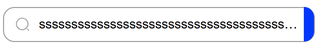
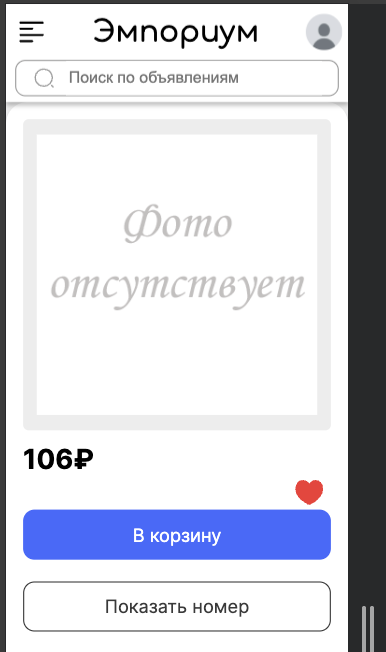

# Тестовый отчет - Команда BogoSort

## 1. Общая информация
**Проект:** Эмпориум  
**Команда:** BogoSort  
**Состав команды:**
- Агеева Ксения 
- Чупраков Сергей 
- Санин Фёдор 
- Куренков Дмитрий

**Ментор:**
- Денис

**Дата начала тестирования:** 25 февраля 2025  
**Дата завершения тестирования:**

## 2. Описание тестирования
**Цель тестирования:** Проверка функциональности и нефункциональных характеристик проекта Эмпориум.

> ***Комментарий:***  
> Позитивные и негативные кейсы

> [!IMPORTANT]  
> Проверка производится в браузере Google Chrome, если не написано иное напрямую

## 3. Структура отчета
1. [Тестирование](#тестирование)
3. [Баги](#баги)
4. [Выводы](#выводы)

---

## 4. Тестирование <a name="тестирование"></a>

### 4.1 Добавление объявления (товара)

#### Создание объявления

##### Позитивные сценарии
- [ ] **Успешное добавление товара** <a name="bug-4.1-001"></a>
  - **Ввод:**
    - Категория: _Спорт и отдых_
    - Название товара: _Jogel Мяч баскетбольный JB-100_
    - Цена: _999_
    - Описание: 
    ```md
    Топовый мяч, хорошо отскакивает от большинства поверхностей. Хорошо подходит для стритбола и как для начала занятий баскетболом, так и для профессиональной деятельности.
    ```
    - Фотография: _Файл изображения см. ниже_
    - Адрес: _Москва, ул. Тверская, 12_  
  - **Действие:** Нажатие на кнопку "Разместить объявление"

    

  - **Ожидание:**
    - Объявление успешно создано и отображается в каталоге.
    - Фотография корректно загружена и отображается в карточке товара.

    
  
    
  
  - **Фактический результат:**
    - [x] Объявление создано, отображается в каталоге.
    - [ ] Изображение не отображается (отсутствует или сломанный значок).

Добавленное изображение:


##### Негативные сценарии

###### Категория

- [ ] **Изменить в html значение value на несуществующее**  <a name="bug-4.1-006"></a>
  - **Ввод:** Категория `Женский гардероб` // Перед этим поменять значение value с `d4d10f10-4f9a-4bd5-ab1e-d2fc3ed35748` на `d4d10f10-4f9a-4bd5-ab1e-d2fc3ed35700`.
  
  

  - **Ожидание:** Не пропустит, вернет ошибку
  - **Фактический результат:** Не пропустило, вернуло ошибку, но с бекенда.

  

  

###### Название товара
- [x] **Название не заполнено**
  - **Ввод:** Пустое поле
  - **Ожидание:** Подсветить поле ввода: "Название".
  - **Фактический результат:** Выделилось красным поле "Название".

  

- [ ] **Название слишком длинное (> 45 символов)** <a name="bug-4.1-002"></a>
  - **Ввод:**
  ```md
  оооооооооооооооооооооооооооооооооооооооооооооооооо
  ```
  - **Ожидание:** Ошибка "Название не должно превышать 45 символов"
  - **Фактический результат:** Система не обработала ошибку, объявление разместилось.
    
  

- [ ] **Название содержит код** <a name="bug-4.1-005"></a>
  - **Ввод:**
  ```js
  <script>alert("Hello")</script>
  ```
  - **Ожидание:** Создание объявления без выведения на экран фразы "Hello"
  - **Фактический результат:** Создание объявления без выведения на экран фразы "Hello", но с пустым названием
- [ ] **Введены битые символы** <a name="bug-4.1-003"></a>
  - **Ввод:** `Hello` // обработанное через https://zalgo.org/
  
  
  
  - **Ожидание:** Вывод соответствующего уведомления о невозможности использования подобных символов
  - **Фактический результат:** Объявление удалось создать
  
    

- [x] **Эмодзи в названии**
  - **Ввод:** `🙂`
  - **Ожидание:** Создание объявления с таким названием.
  - **Фактический результат:** Создание объявления с таким названием.
  
  

###### Цена
- [ ] **Ввод символов после изменения типа (html)** <a name="bug-4.1-004"></a>
  - **Ввод:** `test` // Перед этим изменить type поля на `text`.

  

  - **Ожидание:** Вывод соответствующего уведомления о невозможности использования подобных символов
  - **Фактический результат:** Система пропустила создав объявление с нулевой ценой
  
  

- [x] **Цена равная 0**
  - **Ввод:** `0`
  - **Ожидание:** Система пропустила создав объявление с нулевой ценой
  - **Фактический результат:** Система пропустила создав объявление с нулевой ценой
  
  

- [x] **Отрицательная цена**
  - **Ввод:** `-2`
  
  

  - **Ожидание:** Выделилось красным поле "Цена".
  - **Фактический результат:** Выделилось красным поле "Цена".
  
  

- [x] **Битые цифры (html)**
  - **Ввод:** `1` // обработать через https://zalgo.org/ и перед этим изменить type поля на `text`.
  
  

  - **Ожидание:** Выделилось красным поле "Цена".
  - **Фактический результат:** Выделилось красным поле "Цена".

  

- [x] **Дробные числа**
  - **Ввод:** `0.55555`
  - **Ожидание:** Вывод соответствующего уведомления о невозможности дробной цены
  - **Фактический результат:** Вывод соответствующего уведомления о невозможности дробной цены
  
  

- [x] **Дробные числа (html)**
  - **Ввод:** `0.55555` // Перед этим изменить type поля на `text`.

  

  - **Ожидание:** Вывод соответствующего уведомления о невозможности дробной цены
  - **Фактический результат:** Выделилось красным поле "Цена".

  

- [x] **Пустое поле**
  - **Ввод:** Пустое поле
  - **Ожидание:** Вывод соответствующего уведомления о невозможности пустой цены
  - **Фактический результат:** Выделилось красным поле "Цена".

  

###### Описание

- [x] **Пустое поле**
  - **Ввод:** Пустое поле
  
  

  - **Ожидание:** Вывод соответствующего уведомления о невозможности отсутствия описания
  - **Фактический результат:** Выделилось красным поле "Описание".

  

- [x] **Длинное описание (html)**
  - **Ввод:** 
  ```md
  ssssssssssssssssssssssssssssssssssssssssssssssssssssssssssssssssssssssssssssssssssssssssssssssssssssssssssssssssssssssssssssssssssssssssssssssssssssssssssssssssssssssssssssssssssssssssssssssssssssssssssssssssssssssssssssssssssssssssssssssssssssssssssssssssssssssssssssssssssssssssssssssssssssssssssssssssssssssssssssssssssssssssssssssssssssssssssssssssssssssssssssssssssssssssssssssssssssssssssssssssssssssssssssssssssssssssssssssssssssssssssssssssssssssssssssssssssssssssssssssssssssssssssssssssssssssssssssssssssssssssssssssssssssssssssssssssssssssssssssssssssssssssssssssssssssssssssssssssssssssssssssssssssssssssssssssssssssssssssssssssssssssssssssssssssssssssssssssssssssssssssssssssssssssssssssssssssssssssssssssssssssssssssssssssssssssssssssssssssssssssssssssssssssssssssssssssssssssssssssssssssssssssssssssssssssssssssssssssssssssssssssssssssssssssssssssssssssssssssssssssssssssssssssssssssssssssssssssssssssssssssssssssssssssssssssssssssssssssssssssssssssssssssssssssssssssssssssssssssssssssssssssssssssssssssssssssssssssssssssssssssssssssssssssssssssssssssssssssssssssssssssssssssssssssssssssssssssssssssssssssssssssssssssssssssssssssssssssssssssssssssssssssssssssssssssssssssssssssssssssssssssssssssssssssssssssssssssssssssssssssssssssssssssssssssssssssssssssssssssssssssssssssssssssssssssssssssssssssssssssssssssssssssssssssssssssssssssssssssssssssssssssssssssssssssssssssssssssssssssssssssssssssssssssssssssssssssssssssssssssssssssssssssssssssssssssssssssssssssssssssssssssssssssssssssssssssssssssssssssssssssssssssssssssssssssssssssssssssssssssssssssssssssssssssssssssssssssssssssssssssssssssssssssssssssssssssssssssssssssssssssssssssssssssssssssssssssssssssssssssssssssssssssssssssssssssssssssssssssssssssssssssssssssssssssssssssssssssssssssssssssssssssssssssssssssssssssssssssssssssssssssssssssssssssssssssssssssssssssssssssssssssssssssssssssssssssssssssssssssssssssssssssssssssssssssssssssssssssssssssssssssssssssssssssssssssssssssssssssssssssssssssssssssssssssssssssssssssssssssssssssssssssssssssssssssssssssssssssssssssssssssssssssssssssssssssssssssssssssssssssssssssssssssssssssssssssssssssssssssssssssssssssssssssssssssssssssssssssssssssssssssssssssssssssssssssssssssssssssssssssssssssssssssssssssssssssssssssssssssssssssssssssssssssssssssssssssssssssssssssssssssssssssssssssssssssssssssssssssssssssssssssssssssssssssssssssssssssssssssssssssssssssssssssssssssssssssssssssssssssssssssssssssssssssssssssssssssssssssssssssssssssssssssssssssssssssssssssssssssssssssssssssssssssssssssssssssssssssssssssssssssssssssssssssssssssssssssssssssssssssssssssssssssssssssssssssssssssssssssssssssssssssssssssssssssssssssssssssssssssssssssssssssssssssssssssssssssssssssssssssssssssssssssssssssssssssssssssssssssssssssssssssssssssssssssssssssssssssssssssssssssssssssssssssssssssssssssssssssssssssssssssssssssssssssssssssssssssssssssssssssssssssssssssssssssssssssssssssssssssssssssssssssssssssssssssssssssssssssssssssssssssssssssssssssssssssssssssssssssssssssssssssssssssssssssssssssssssssssssssssssssssssssssssssssssssssssssssssssssssssssssssssssssssssssssssssssssssssssssssssssssssssssssssssssssssssssssssssssssssssssssssssssssssssssssssssssssssssssssssssssssssssssssssssssssssssssssssssssssssssssssssssssssssssssssssssssssssssssssssssssssssssssssssssssssssssssssssssssssssssssssssssssssssssssssssssssssssssssssssssssssssssssssssssssssssssssssssssssssssssssssssssssssssssssssssssssssssssssssssssssssssssssssssssssssssssssssssssssssssssssssssssssssssssssssssssssssssssssssssssssssssssssssssssssssssssssssssssssssssssssssssssssssssssssssssssssssssssssssssssssssssssssssssssssssssssssssssssssssssssssssssssssssssssssssssssssssssssssssssssssssssssssssssssssssssssssssssssssssssssssssssssssssssssssssssssssssssssssssssssssssssssssssssssssssssssssssssssssssssssssssssssssssssssssssssssssssssssssssssssssssssssssssssssssssssssssssssssssssssssssssssssssssssssssssssssssssssssssssssssssssssssssssssssssssssssssssssssssssssssssssssssssssssssssssssssssssssssssssssssssssssssssssssssssssssssssssssssssssssssssssssssssssssssssssssssssssssssssssssssssssssssssssssssssssssssssssssssssssssssssssssssssssssssssssssssssssssssssssssssssssssssssssssssssssssssssssssssssssssssssssssssssssssssssssssssssssssssssssssssssssssssssssssssssssssssssssssssssssssssssssssssssssssssssssssssssssssssssssssssssssssssssssssssssssssssssssssssssssssssssssssssssssssssssssssssssssssssssssssssssssssssssssssssssssssssssssssssssssssssssssssssssssssssssssssssssssssssssssssssssssssssssssssssssssssssssssssssssssssssssssssssssssssssssssssssssssssssssssssssssssssssssssssssssssssssssssssssssssssssssssssssssssssssssssssssssssssssssssssssssssssssssssssssssssssssssssssssssssssssssssssssssssssssssssssssssssssssssssssssssssssssssssssssssssssssssssssssssssssssssssssssssssssssssssssssssssssssssssssssssssssssssssssssssssssssssssssssssssssssssssssssssssssssssssssssssssssssssssssssssssssssssssssssssssssssssssssssssssssssssssssssssssssssssssssssssssssssssssssssssssssssssssssssssssssssssssssssssssssssssssssssssssssssssssssssssssssssssssssssssssssssssssssssssssssssssssssssssssssssssssssssssssssssssssssssssssssssssssssssssssssssssssssssssssssssssssssssssssssssssssssssssssssssssssssssssssssssssssssssssssssssssssssssssssssssssssssssssssssssssssssssssssssssssssssssssssssssssssssssssssssssssssssssssssssssssssssssssssssssssssssssssssssssssssssssssssssssssssssssssssssssssssssssssssssssssssssssssssssssssssssssssssssssssssssssssssssssssssssssssssssssssssssssssssssssssssssssssssssssssssssssssssssssssssssssssssssssssssssssssssssssssssssssssssssssssssssssssssssssssssssssssssssssssssssssssssssssssssssssssssssssssssssssssssssssssssssssssssssssssssssssssssssssssssssssssssssssssssssssssssssssssssssssssssssssssssssssssssssssssssssssssssssssssssssssssssssssssssssssssssssssssssssssssssssssssssssssssssssssssssssssssssssssssssssssssssssssssssssssssssssssssssssssssssssssssssssssssssssssssssssssssssssssssssssssssssssssssssssssssssssssssssssssssssssssssssssssssssssssssssssssssssssssssssssssssssssssssssssssssssssssssssssssssssssssssssssssssssssss
  ```

  /img.png)

  - **Ожидание:** Вывод соответствующего уведомления о невозможности отсутствия описания
  - **Фактический результат:** Выделилось красным поле "Описание".

  /img_1.png)

- [ ] **Описание содержит код** <a name="bug-4.1-007"></a>
  - **Ввод:**
  ```js
  <script>alert("Hello")</script>
  ```
  - **Ожидание:** Создание объявления без выведения на экран фразы "Hello"
  - **Фактический результат:** Создание объявления без выведения на экран фразы "Hello", но с пустым описанием

- [ ] **Введены битые символы** <a name="bug-4.1-008"></a>
  - **Ввод:** `Hello` // обработанное через https://zalgo.org/

    

  - **Ожидание:** Вывод соответствующего уведомления о невозможности использования подобных символов
  - **Фактический результат:** Объявление удалось создать

    

- [ ] **Введены сильно битые символы** <a name="bug-4.1-009"></a>
  - **Ввод:** `Hello` // обработанное через https://zalgo.org/

    

  - **Ожидание:** Вывод соответствующего уведомления о невозможности использования подобных символов
  - **Фактический результат:** Несколько ошибок с бекенда, ошибка открытия объявления, хотя на фронте отрабатывает как для созданного

    

    

###### Фотография

- [ ] **Попытка добавить png** <a name="bug-4.1-010"></a>
  - **Ввод:** png и zip (адрес - `img/4.1/Создание объявления/Негативные сценарии/Фотография/png-zip/test.zip`)

    

  - **Ожидание:** Вывод соответствующего уведомления о невозможности использования подобного типа
  - **Фактический результат:** Объявление удалось создать

###### Адрес

- [x] **Пустое поле**
  - **Ввод:** Пустое поле
  - **Ожидание:** Вывод соответствующего уведомления о невозможности отсутствия адреса
  - **Фактический результат:** Выделилось красным поле "Адрес".

  

- [x] **Длинный адрес (html)**
  - **Ввод:**
  ```md
  ssssssssssssssssssssssssssssssssssssssssssssssssssssssssssssssssssssssssssssssssssssssssssssssssssssssssssssssssssssssssssssssssssssssssssssssssssssssssssssssssssssssssssssssssssssssssssssssssssssssssssssssssssssssssssssssssssssssssssssssssssssssssssssssssssssssssssssssssssssssssssssssssssssssssssss
  ```

  /img.png)

  - **Ожидание:** Вывод соответствующего уведомления о невозможности отсутствия адреса
  - **Фактический результат:** Выделилось красным поле "Адрес".

  /img_1.png)

- [x] **Адрес содержит код**
  - **Ввод:**
  ```js
  <script>alert("Hello")</script>
  ```
  - **Ожидание:** Создание объявления без выведения на экран фразы "Hello"
  - **Фактический результат:** Создание объявления без выведения на экран фразы "Hello"

  

- [ ] **Введены битые символы** <a name="bug-4.1-011"></a>
  - **Ввод:** `Hello` // обработанное через https://zalgo.org/

    

  - **Ожидание:** Вывод соответствующего уведомления о невозможности использования подобных символов
  - **Фактический результат:** Несколько ошибок с бекенда, ошибка открытия объявления, хотя на фронте отрабатывает как для созданного

    

    

- [ ] **Введен эмодзи** <a name="bug-4.1-016"></a>
  - **Ввод:** `😀`

    

  - **Ожидание:** Вывод соответствующего уведомления о невозможности использования подобных символов
  - **Фактический результат:** Объявление создалось

    

##### Визуальные

###### Категория

- [ ] **Уменьшение экрана до ширины 300px** <a name="bug-4.1-012"></a>
  - **Фактический результат:** Выход за границы экрана

  

###### Название

- [ ] **Уменьшение экрана до ширины 300px** <a name="bug-4.1-013"></a>
  - **Фактический результат:** Выход за границы экрана (поля ввода и комментария по ограничению размера)

  

###### Описание

- [ ] **Уменьшение экрана до ширины 300px** <a name="bug-4.1-014"></a>
  - **Фактический результат:** Выход за границы экрана (поля ввода и комментария по ограничению размера)

  

###### Адрес

- [ ] **Уменьшение экрана до ширины 300px** <a name="bug-4.1-015"></a>
  - **Фактический результат:** Выход за границы экрана (поля ввода и комментария по ограничению размера)

  

###### Кнопка

- [ ] **Уменьшение экрана до ширины 300px** <a name="bug-4.1-017"></a>
  - **Фактический результат:** Кнопка переход на страницу создания уезжает вниз и загораживает кнопку, благодаря которой можем разместить объявление

  

###### Форма

- [ ] **Уменьшение экрана до ширины 1000px и меньше** <a name="bug-4.1-018"></a>
  - **Фактический результат:** Форма не помещается, появляется горизонтальный ползунок

  

###### Оглавление

- [ ] **Уменьшение экрана до ширины 300px** <a name="bug-4.1-019"></a>
  - **Фактический результат:** Оглавление прижато к левому краю

  

##### Визуальные в других браузерах

###### Safari

- [x] **Новых ошибок визуала нет (не считая поля выбора категории)**
  - **Фактический результат:** Новые ошибки не появилось (в сравнении с Google Chrome)

  
  
  

- [ ] **Поле выбора категории** <a name="bug-4.1-020"></a>
  - **Фактический результат:** Нет окантовки (обводка поля выбора)

  

###### FireFox

- [x] **Новых ошибок визуала нет**
  - **Фактический результат:** Новые ошибки не появилось (в сравнении с Google Chrome)

  

  
  
  
  
  

###### Opera

- [x] **Новых ошибок визуала нет**
  - **Фактический результат:** Новые ошибки не появилось (в сравнении с Google Chrome)

  

  

  

  

###### Microsoft Edge

- [x] **Новых ошибок визуала нет**
  - **Фактический результат:** Новые ошибки не появилось (в сравнении с Google Chrome)

  

  

  

  

###### Yandex

- [x] **Новых ошибок визуала нет**
  - **Фактический результат:** Новые ошибки не появилось (в сравнении с Google Chrome)

  

  

  

  

<br/><br/><br/>

### 4.2 Редактирование объявления

#### Редактирование объявления

##### Позитивные сценарии
- [ ] **Успешное редактирование объявления** <a name="bug-4.2-001"></a>
  - **Ввод:**
    - Категория: _Спорт и отдых_
    - Название товара: _Jogel Мяч баскетбольный JB-100_
    - Цена: _999_
    - Описание:
    ```md
    Топовый мяч, хорошо отскакивает от большинства поверхностей. Хорошо подходит для стритбола и как для начала занятий баскетболом, так и для профессиональной деятельности.
    ```
    - Фотография: _Файл изображения см. ниже_
    - Адрес: _Москва, ул. Тверская, 12_
  - **Действие:** Нажатие на кнопку "Сохранить изменения"

    

  - **Ожидание:**
    - Объявление успешно изменено и отображается в каталоге.
    - Фотография корректно загружена и отображается в карточке товара.

    

    

  - **Фактический результат:**
    - [x] Объявление изменено, отображается в каталоге.
    - [ ] Изображение не отображается (отсутствует или сломанный значок).

Добавленное изображение:


##### Негативные сценарии

###### Категория

- [ ] **Изменить в html значение value на несуществующее**  <a name="bug-4.2-006"></a>
  - **Ввод:** Категория `Женский гардероб` // Перед этим поменять значение value с `d4d10f10-4f9a-4bd5-ab1e-d2fc3ed35748` на `d4d10f10-4f9a-4bd5-ab1e-d2fc3ed35700`.

  

  - **Ожидание:** Не пропустит, вернет ошибку
  - **Фактический результат:** Не пропустило, вернуло ошибку, но с бекенда.

  

  

###### Название товара

- [x] **Название не заполнено**
  - **Ввод:** Пустое поле
  - **Ожидание:** Подсветить поле ввода: "Название".
  - **Фактический результат:** Выделилось красным поле "Название".

  

- [ ] **Название слишком длинное (> 45 символов)** <a name="bug-4.2-002"></a>
  - **Ввод:**
  ```md
  ssssssssssssssssssssssssssssssssssssssssssssssssss
  ```
  - **Ожидание:** Ошибка "Название не должно превышать 45 символов"
  - **Фактический результат:** Система не обработала ошибку, объявление изменилось.

  

- [ ] **Название содержит код** <a name="bug-4.2-005"></a>
  - **Ввод:**
  ```js
  <script>alert("Hello")</script>
  ```
  
  

  - **Ожидание:** Изменилось объявления без выведения на экран фразы "Hello"
  - **Фактический результат:** Изменение объявления без выведения на экран фразы "Hello", но название сменилось на пустое

  

- [ ] **Введены битые символы** <a name="bug-4.2-003"></a>
  - **Ввод:** `Hello` // обработанное через https://zalgo.org/

  

  - **Ожидание:** Вывод соответствующего уведомления о невозможности использования подобных символов
  - **Фактический результат:** Объявление удалось изменить

    

- [x] **Эмодзи в названии**
  - **Ввод:** `🙂`
  - **Ожидание:** Изменение объявления с таким названием.
  - **Фактический результат:** Изменение объявления с таким названием.

  

###### Цена

- [ ] **Ввод символов после изменения типа (html)** <a name="bug-4.2-004"></a>
  - **Ввод:** `test` // Перед этим изменить type поля на `text`.

  

  - **Ожидание:** Вывод соответствующего уведомления о невозможности использования подобных символов
  - **Фактический результат:** Система пропустила, изменив объявление на нулевую цену

  

- [x] **Цена равная 0**
  - **Ввод:** `0`
  - **Ожидание:** Система пропустила создав объявление с нулевой ценой
  - **Фактический результат:** Система пропустила, изменив в объявлении цену на ноль

  

- [x] **Отрицательная цена**
  - **Ввод:** `-2`

  

  - **Ожидание:** Выделилось красным поле "Цена".
  - **Фактический результат:** Выделилось красным поле "Цена".

  

- [x] **Битые цифры (html)**
  - **Ввод:** `1` // обработать через https://zalgo.org/ и перед этим изменить type поля на `text`.

  

  - **Ожидание:** Выделилось красным поле "Цена".
  - **Фактический результат:** Выделилось красным поле "Цена".

  

- [x] **Дробные числа**
  - **Ввод:** `0.55555`
  - **Ожидание:** Вывод соответствующего уведомления о невозможности дробной цены
  - **Фактический результат:** Вывод соответствующего уведомления о невозможности дробной цены

  

- [x] **Дробные числа (html)**
  - **Ввод:** `0.55555` // Перед этим изменить type поля на `text`.

  

  - **Ожидание:** Вывод соответствующего уведомления о невозможности дробной цены
  - **Фактический результат:** Выделилось красным поле "Цена".

  

- [x] **Пустое поле**
  - **Ввод:** Пустое поле
  - **Ожидание:** Вывод соответствующего уведомления о невозможности пустой цены
  - **Фактический результат:** Выделилось красным поле "Цена".

  

###### Описание

- [x] **Пустое поле**
  - **Ввод:** Пустое поле

  

  - **Ожидание:** Вывод соответствующего уведомления о невозможности отсутствия описания
  - **Фактический результат:** Выделилось красным поле "Описание".

  

- [x] **Длинное описание (html)**
  - **Ввод:** // Сначала убрать атрибут `maxlength`
  ```md
  ssssssssssssssssssssssssssssssssssssssssssssssssssssssssssssssssssssssssssssssssssssssssssssssssssssssssssssssssssssssssssssssssssssssssssssssssssssssssssssssssssssssssssssssssssssssssssssssssssssssssssssssssssssssssssssssssssssssssssssssssssssssssssssssssssssssssssssssssssssssssssssssssssssssssssssssssssssssssssssssssssssssssssssssssssssssssssssssssssssssssssssssssssssssssssssssssssssssssssssssssssssssssssssssssssssssssssssssssssssssssssssssssssssssssssssssssssssssssssssssssssssssssssssssssssssssssssssssssssssssssssssssssssssssssssssssssssssssssssssssssssssssssssssssssssssssssssssssssssssssssssssssssssssssssssssssssssssssssssssssssssssssssssssssssssssssssssssssssssssssssssssssssssssssssssssssssssssssssssssssssssssssssssssssssssssssssssssssssssssssssssssssssssssssssssssssssssssssssssssssssssssssssssssssssssssssssssssssssssssssssssssssssssssssssssssssssssssssssssssssssssssssssssssssssssssssssssssssssssssssssssssssssssssssssssssssssssssssssssssssssssssssssssssssssssssssssssssssssssssssssssssssssssssssssssssssssssssssssssssssssssssssssssssssssssssssssssssssssssssssssssssssssssssssssssssssssssssssssssssssssssssssssssssssssssssssssssssssssssssssssssssssssssssssssssssssssssssssssssssssssssssssssssssssssssssssssssssssssssssssssssssssssssssssssssssssssssssssssssssssssssssssssssssssssssssssssssssssssssssssssssssssssssssssssssssssssssssssssssssssssssssssssssssssssssssssssssssssssssssssssssssssssssssssssssssssssssssssssssssssssssssssssssssssssssssssssssssssssssssssssssssssssssssssssssssssssssssssssssssssssssssssssssssssssssssssssssssssssssssssssssssssssssssssssssssssssssssssssssssssssssssssssssssssssssssssssssssssssssssssssssssssssssssssssssssssssssssssssssssssssssssssssssssssssssssssssssssssssssssssssssssssssssssssssssssssssssssssssssssssssssssssssssssssssssssssssssssssssssssssssssssssssssssssssssssssssssssssssssssssssssssssssssssssssssssssssssssssssssssssssssssssssssssssssssssssssssssssssssssssssssssssssssssssssssssssssssssssssssssssssssssssssssssssssssssssssssssssssssssssssssssssssssssssssssssssssssssssssssssssssssssssssssssssssssssssssssssssssssssssssssssssssssssssssssssssssssssssssssssssssssssssssssssssssssssssssssssssssssssssssssssssssssssssssssssssssssssssssssssssssssssssssssssssssssssssssssssssssssssssssssssssssssssssssssssssssssssssssssssssssssssssssssssssssssssssssssssssssssssssssssssssssssssssssssssssssssssssssssssssssssssssssssssssssssssssssssssssssssssssssssssssssssssssssssssssssssssssssssssssssssssssssssssssssssssssssssssssssssssssssssssssssssssssssssssssssssssssssssssssssssssssssssssssssssssssssssssssssssssssssssssssssssssssssssssssssssssssssssssssssssssssssssssssssssssssssssssssssssssssssssssssssssssssssssssssssssssssssssssssssssssssssssssssssssssssssssssssssssssssssssssssssssssssssssssssssssssssssssssssssssssssssssssssssssssssssssssssssssssssssssssssssssssssssssssssssssssssssssssssssssssssssssssssssssssssssssssssssssssssssssssssssssssssssssssssssssssssssssssssssssssssssssssssssssssssssssssssssssssssssssssssssssssssssssssssssssssssssssssssssssssssssssssssssssssssssssssssssssssssssssssssssssssssssssssssssssssssssssssssssssssssssssssssssssssssssssssssssssssssssssssssssssssssssssssssssssssssssssssssssssssssssssssssssssssssssssssssssssssssssssssssssssssssssssssssssssssssssssssssssssssssssssssssssssssssssssssssssssssssssssssssssssssssssssssssssssssssssssssssssssssssssssssssssssssssssssssssssssssssssssssssssssssssssssssssssssssssssssssssssssssssssssssssssssssssssssssssssssssssssssssssssssssssssssssssssssssssssssssssssssssssssssssssssssssssssssssssssssssssssssssssssssssssssssssssssssssssssssssssssssssssssssssssssssssssssssssssssssssssssssssssssssssssssssssssssssssssssssssssssssssssssssssssssssssssssssssssssssssssssssssssssssssssssssssssssssssssssssssssssssssssssssssssssssssssssssssssssssssssssssssssssssssssssssssssssssssssssssssssssssssssssssssssssssssssssssssssssssssssssssssssssssssssssssssssssssssssssssssssssssssssssssssssssssssssssssssssssssssssssssssssssssssssssssssssssssssssssssssssssssssssssssssssssssssssssssssssssssssssssssssssssssssssssssssssssssssssssssssssssssssssssssssssssssssssssssssssssssssssssssssssssssssssssssssssssssssssssssssssssssssssssssssssssssssssssssssssssssssssssssssssssssssssssssssssssssssssssssssssssssssssssssssssssssssssssssssssssssssssssssssssssssssssssssssssssssssssssssssssssssssssssssssssssssssssssssssssssssssssssssssssssssssssssssssssssssssssssssssssssssssssssssssssssssssssssssssssssssssssssssssssssssssssssssssssssssssssssssssssssssssssssssssssssssssssssssssssssssssssssssssssssssssssssssssssssssssssssssssssssssssssssssssssssssssssssssssssssssssssssssssssssssssssssssssssssssssssssssssssssssssssssssssssssssssssssssssssssssssssssssssssssssssssssssssssssssssssssssssssssssssssssssssssssssssssssssssssssssssssssssssssssssssssssssssssssssssssssssssssssssssssssssssssssssssssssssssssssssssssssssssssssssssssssssssssssssssssssssssssssssssssssssssssssssssssssssssssssssssssssssssssssssssssssssssssssssssssssssssssssssssssssssssssssssssssssssssssssssssssssssssssssssssssssssssssssssssssssssssssssssssssssssssssssssssssssssssssssssssssssssssssssssssssssssssssssssssssssssssssssssssssssssssssssssssssssssssssssssssssssssssssssssssssssssssssssssssssssssssssssssssssssssssssssssssssssssssssssssssssssssssssssssssssssssssssssssssssssssssssssssssssssssssssssssssssssssssssssssssssssssssssssssssssssssssssssssssssssssssssssssssssssssssssssssssssssssssssssssssssssssssssssssssssssssssssssssssssssssssssssssssssssssssssssssssssssssssssssssssssssssssssssssssssssssssssssssssssssssssssssssssssssssssssssssssssssssssssssssssssssssssssssssssssssssssssssssssssssssssssssssssssssssssssssssssssssssssssssssssssssssssssssssssssssssssssssssssssssssssssssssssssssssssssssssssssssssssssssssssssssssssssssssssssssssssssssssssssssssssssssssssssssssssssssssssssssssssssssssssssssssssssssssssssssssssssssssssssssssssssssssssssssssssssssssssssssssssssssssssssssssssssssssssssssssssssssssssssssssssssssssssssssssssssssssssssssssssssssssssssssssssssssssssssssssssssssssssssssssssssssssssssssssssssssssssssssssssssssssssssss
  ```

  

  - **Ожидание:** Вывод соответствующего уведомления о невозможности отсутствия описания
  - **Фактический результат:** Выделилось красным поле "Описание".

  

- [ ] **Описание содержит код** <a name="bug-4.2-007"></a>
  - **Ввод:**
  ```js
  <script>alert("Hello")</script>
  ```
  - **Ожидание:** Изменение объявления без выведения на экран фразы "Hello"
  - **Фактический результат:** Изменение объявления без выведения на экран фразы "Hello", но на пустое значение

  

- [ ] **Введены битые символы** <a name="bug-4.2-008"></a>
  - **Ввод:** `Hello` // обработанное через https://zalgo.org/

    

  - **Ожидание:** Вывод соответствующего уведомления о невозможности использования подобных символов
  - **Фактический результат:** Объявление удалось изменить

    

- [ ] **Введены сильно битые символы** <a name="bug-4.2-009"></a>
  - **Ввод:** `Hello` // обработанное через https://zalgo.org/

    

  - **Ожидание:** Вывод соответствующего уведомления о невозможности использования подобных символов
  - **Фактический результат:** Ошибка с бекенда, открывает со старым описанием

    

###### Фотография

- [ ] **Попытка добавить png** <a name="bug-4.2-010"></a>
  - **Ввод:** png и zip (адрес - `img/4.2/Редактирование объявления/Негативные сценарии/Фотография/png-zip/test.zip`)

    

  - **Ожидание:** Вывод соответствующего уведомления о невозможности использования подобного типа
  - **Фактический результат:** Объявление не удалось изменить, но ответ с бекенда, а не фронта

    
  
    

###### Адрес

- [x] **Пустое поле**
  - **Ввод:** Пустое поле
  - **Ожидание:** Вывод соответствующего уведомления о невозможности отсутствия адреса
  - **Фактический результат:** Выделилось красным поле "Адрес".

  

- [x] **Длинный адрес (html)**
  - **Ввод:**
  ```md
  ssssssssssssssssssssssssssssssssssssssssssssssssssssssssssssssssssssssssssssssssssssssssssssssssssssssssssssssssssssssssssssssssssssssssssssssssssssssssssssssssssssssssssssssssssssssssssssssssssssssssssssssssssssssssssssssssssssssssssssssssssssssssssssssssssssssssssssssssssssssssssssssssssssssssssss
  ```

  /img.png)

  - **Ожидание:** Вывод соответствующего уведомления о невозможности такого адреса
  - **Фактический результат:** Выделилось красным поле "Адрес".

  /img_1.png)

- [x] **Адрес содержит код**
  - **Ввод:**
  ```js
  <script>alert("Hello")</script>
  ```
  - **Ожидание:** Изменение объявления без выведения на экран фразы "Hello"
  - **Фактический результат:** Изменение объявления без выведения на экран фразы "Hello"

  

- [ ] **Введены битые символы** <a name="bug-4.2-011"></a>
  - **Ввод:** `Hello` // обработанное через https://zalgo.org/

    

  - **Ожидание:** Вывод соответствующего уведомления о невозможности использования подобных символов
  - **Фактический результат:** Ошибка с бекенда, открывает со старым описанием

    

- [ ] **Введен эмодзи** <a name="bug-4.2-016"></a>
  - **Ввод:** `😀`

    

  - **Ожидание:** Вывод соответствующего уведомления о невозможности использования подобных символов
  - **Фактический результат:** Объявление изменилось

    

##### Визуальные

###### Категория

- [ ] **Уменьшение экрана до ширины 300px** <a name="bug-4.2-012"></a>
  - **Фактический результат:** Выход за границы экрана

  

###### Название

- [ ] **Уменьшение экрана до ширины 300px** <a name="bug-4.2-013"></a>
  - **Фактический результат:** Выход за границы экрана (поля ввода и комментария по ограничению размера)

  

###### Описание

- [ ] **Уменьшение экрана до ширины 300px** <a name="bug-4.2-014"></a>
  - **Фактический результат:** Выход за границы экрана (поля ввода и комментария по ограничению размера)

  

###### Адрес

- [ ] **Уменьшение экрана до ширины 300px** <a name="bug-4.2-015"></a>
  - **Фактический результат:** Выход за границы экрана (поля ввода и комментария по ограничению размера)

  

###### Кнопка

- [ ] **Уменьшение экрана до ширины 300px** <a name="bug-4.2-017"></a>
  - **Фактический результат:** Выход за границы экрана

  

###### Форма

- [ ] **Уменьшение экрана до ширины 1000px и меньше** <a name="bug-4.2-018"></a>
  - **Фактический результат:** Форма не помещается, появляется горизонтальный ползунок

  

###### Оглавление

- [ ] **Уменьшение экрана до ширины 300px** <a name="bug-4.2-019"></a>
  - **Фактический результат:** Оглавление прижато к левому краю

  

##### Визуальные в других браузерах

<br/><br/><br/>

### 4.3 Страница своего товара

<br/><br/><br/>

### 4.4 Поиск

##### Позитивные сценарии

- [x] **Успешный поиск товара по полному названию**
  - **Ввод:** `Настольная игра`
  - **Действие:** Нажатие на кнопку поиска

    

  - **Ожидание:** Удалось успешно найти товар
  - **Фактический результат:** Удалось успешно найти товар

    

- [x] **Успешный поиск товара по неполному названию**
  - **Ввод:** `Настольная игр`
  - **Действие:** Нажатие на кнопку поиска

    

  - **Ожидание:** Удалось успешно найти товар
  - **Фактический результат:** Удалось успешно найти товар

    

- [ ] **Возврат к прошлому запросу** <a name="bug-4.4-001"></a>
  - **Ввод:** `Настольная игр`
  - **Действие:** Нажатие на кнопку поиска

    

  - **Ввод:** `Настольная игра`
  - **Действие:** Нажатие на кнопку поиска

    

  - **Действие:** Нажатие на кнопку вернуться

    

  - **Ожидание:** Видно предыдущий запрос
  - **Фактический результат:** Поломалась верстка

    

##### Негативные сценарии

- [ ] **Поиск пустоты**  <a name="bug-4.4-002"></a>
  - **Ввод:** Пустая строка

    

  - **Действие:** Нажатие на кнопку поиска
  - **Ожидание:** Должно подсказать, что ничего не введено
  - **Фактический результат:** Ничего не произошло

- [ ] **Поиск несуществующего товара**  <a name="bug-4.4-003"></a>
  - **Ввод:** `что-то непонятное`

    

  - **Действие:** Нажатие на кнопку поиска
  - **Ожидание:** Должно подсказать, что таких товаров нет
  - **Фактический результат:** Пустая страница

    

- [ ] **Битые символы**  <a name="bug-4.4-004"></a>
  - **Ввод:** `Настольная игра` // обработанное через https://zalgo.org/

    

  - **Действие:** Нажатие на кнопку поиска
  - **Ожидание:** Должно подсказать, что таких товаров нет
  - **Фактический результат:** Ошибка с бекенда

    

- [ ] **Большой запрос**  <a name="bug-4.4-005"></a>
  - **Ввод:** 
  ```md
  ssssssssssssssssssssssssssssssssssssssssssssssssssssssssssssssssssssssssssssssssssssssssssssssssssssssssssssssssssssssssssssssssssssssssssssssssssssssssssssssssssssssssssssssssssssssssssssssssssssssssssssssssssssssssssssssssssssssssssssssssssssssssssssssssssssssssssssssssssssssssssssssssssssssssssssssssssssssssssssssssssssssssssssssssssssssssssssssssssssssssssssssssssssssssssssssssssssssssssssssssssssssssssssssssssssssssssssssssssssssssssssssssssssssssssssssssssssssssssssssssssssssssssssssssssssssssssssssssssssssssssssssssssssssssssssssssssssssssssssssssssssssssssssssssssssssssssssssssssssssssssssssssssssssssssssssssssssssssssssssssssssssssssssssssssssssssssssssssssssssssssssssssssssssssssssssssssssssssssssssssssssssssssssssssssssssssssssssssssssssssssssssssssssssssssssssssssssssssssssssssssssssssssssssssssssssssssssssssssssssssssssssssssssssssssssssssssssssssssssssssssssssssssssssssssssssssssssssssssssssssssssssssssssssssssssssssssssssssssssssssssssssssssssssssssssssssssssssssssssssssssssssssssssssssssssssssssssssssssssssssssssssssssssssssssssssssssssssssssssssssssssssssssssssssssssssssssssssssssssssssssssssssssssssssssssssssssssssssssssssssssssssssssssssssssssssssssssssssssssssssssssssssssssssssssssssssssssssssssssssssssssssssssssssssssssssssssssssssssssssssssssssssssssssssssssssssssssssssssssssssssssssssssssssssssssssssssssssssssssssssssssssssssssssssssssssssssssssssssssssssssssssssssssssssssssssssssssssssssssssssssssssssssssssssssssssssssssssssssssssssssssssssssssssssssssssssssssssssssssssssssssssssssssssssssssssssssssssssssssssssssssssssssssssssssssssssssssssssssssssssssssssssssssssssssssssssssssssssssssssssssssssssssssssssssssssssssssssssssssssssssssssssssssssssssssssssssssssssssssssssssssssssssssssssssssssssssssssssssssssssssssssssssssssssssssssssssssssssssssssssssssssssssssssssssssssssssssssssssssssssssssssssssssssssssssssssssssssssssssssssssssssssssssssssssssssssssssssssssssssssssssssssssssssssssssssssssssssssssssssssssssssssssssssssssssssssssssssssssssssssssssssssssssssssssssssssssssssssssssssssssssssssssssssssssssssssssssssssssssssssssssssssssssssssssssssssssssssssssssssssssssssssssssssssssssssssssssssssssssssssssssssssssssssssssssssssssssssssssssssssssssssssssssssssssssssssssssssssssssssssssssssssssssssssssssssssssssssssssssssssssssssssssssssssssssssssssssssssssssssssssssssssssssssssssssssssssssssssssssssssssssssssssssssssssssssssssssssssssssssssssssssssssssssssssssssssssssssssssssssssssssssssssssssssssssssssssssssssssssssssssssssssssssssssssssssssssssssssssssssssssssssssssssssssssssssssssssssssssssssssssssssssssssssssssssssssssssssssssssssssssssssssssssssssssssssssssssssssssssssssssssssssssssssssssssssssssssssssssssssssssssssssssssssssssssssssssssssssssssssssssssssssssssssssssssssssssssssssssssssssssssssssssssssssssssssssssssssssssssssssssssssssssssssssssssssssssssssssssssssssssssssssssssssssssssssssssssssssssssssssssssssssssssssssssssssssssssssssssssssssssssssssssssssssssssssssssssssssssssssssssssssssssssssssssssssssssssssssssssssssssssssssssssssssssssssssssssssssssssssssssssssssssssssssssssssssssssssssssssssssssssssssssssssssssssssssssssssssssssssssssssssssssssssssssssssssssssssssssssssssssssssssssssssssssssssssssssssssssssssssssssssssssssssssssssssssssssssssssssssssssssssssssssssssssssssssssssssssssssssssssssssssssssssssssssssssssssssssssssssssssssssssssssssssssssssssssssssssssssssssssssssssssssssssssssssssssssssssssssssssssssssssssssssssssssssssssssssssssssssssssssssssssssssssssssssssssssssssssssssssssssssssssssssssssssssssssssssssssssssssssssssssssssssssssssssssssssssssssssssssssssssssssssssssssssssssssssssssssssssssssssssssssssssssssssssssssssssssssssssssssssssssssssssssssssssssssssssssssssssssssssssssssssssssssssssssssssssssssssssssssssssssssssssssssssssssssssssssssssssssssssssssssssssssssssssssssssssssssssssssssssssssssssssssssssssssssssssssssssssssssssssssssssssssssssssssssssssssssssssssssssssssssssssssssssssssssssssssssssssssssssssssssssssssssssssssssssssssssssssssssssssssssssssssssssssssssssssssssssssssssssssssssssssssssssssssssssssssssssssssssssssssssssssssssssssssssssssssssssssssssssssssssssssssssssssssssssssssssssssssssssssssssssssssssssssssssssssssssssssssssssssssssssssssssssssssssssssssssssssssssssssssssssssssssssssssssssssssssssssssssssssssssssssssssssssssssssssssssssssssssssssssssssssssssssssssssssssssssssssssssssssssssssssssssssssssssssssssssssssssssssssssssssssssssssssssssssssssssssssssssssssssssssssssssssssssssssssssssssssssssssssssssssssssssssssssssssssssssssssssssssssssssssssssssssssssssssssssssssssssssssssssssssssssssssssssssssssssssssssssssssssssssssssssssssssssssssssssssssssssssssssssssssssssssssssssssssssssssssssssssssssssssssssssssssssssssssssssssssssssssssssssssssssssssssssssssssssssssssssssssssssssssssssssssssssssssssssssssssssssssssssssssssssssssssssssssssssssssssssssssssssssssssssssssssssssssssssssssssssssssssssssssssssssssssssssssssssssssssssssssssssssssssssssssssssssssssssssssssssssssssssssssssssssssssssssssssssssssssssssssssssssssssssssssssssssssssssssssssssssssssssssssssssssssssssssssssssssssssssssssssssssssssssssssssssssssssssssssssssssssssssssssssssssssssssssssssssssssssssssssssssssssssssssssssssssssssssssssssssssssssssssssssssssssssssssssssssssssssssssssssssssssssssssssssssssssssssssssssssssssssssssssssssssssssssssssssssssssssssssssssssssssssssssssssssssssssssssssssssssssssssssssssssssssssssssssssssssssssssssssssssssssssssssssssssssssssssssssssssssssssssssssssssssssssssssssssssssssssssssssssssssssssssssssssssssssssssssssssssssssssssssssssssssssssssssssssssssssssssssssssssssssssssssssssssssssssssssssssssssssssssssssssssssssssssssssssssssssssssssssssssssssssssssssssssssssssssssssssssssssssssssssssssssssssssssssssssssssssssssssssssssssssssssssssssssssssssssssssssssssssssssssssssssssssssssssssssssssssssssssssssssssssssssssssssssssssssssssssssssssssssssssssssssssssssssssssssssssssssssssssssssssssssssssssssssssssssssssssssssssssssssssssssssssssssssssssssssssssssssssssssssssssssssssssssssssssssssssssssssssssssssssssssssssssssssssssssssssssssssssssssssssssssssssssssssssssssssssssssssssssssssssssssssssssssssssssssssssssssssssssssssssssssssssssssssssssssssssssssssssssssssssssssssssssssssssssssssssssssssssssssssssssssssssssssssssssssssssssssssssssssssssssssssssssssssssssssssssssssssssssssssssssssssssssssssssssssssssssssssssssssssssssssssssssssssssssssssssssssssssssssssssssssssssssssssssssssssssssssssssssssssssssssssssssssssssssssssssssssssssssssssssssssssssssssssssssssssssssssssssssssssssssssssssssssssssssssssssssssssssssssssssssssssssssssssssssssssssssssssssssssssssssssssssssssssssssssssssssssssssssssssssssssssssssssssssssssssssssssssssssssssssssssssssssssssssssssssssssssssssssssssssssssssssssssssssssssssssssssssssssssssssssssssssssssssssssssssssssssssssssssssssssssssssssssssssssssssssssssssssssssssssssssssssssssssssssssssssssssssssssssssssssssssssssssssssssssssssssssssssssssssssssssssssssssssssssssssssssssssssssssssssssssssssssssssssssssssssssssssssssssssssssssssssssssssssssssssssssssssssssssssssssssssssssssssssssssssssssssssssssssssssssssssssssssssssssssssssssssssssssssssssssssssssssssssssssssssssssssssssssssssssssssssssssssssssssssssssssssssssssssssssssssssssssssssssssssssssssssssssssssssssssssssssssssssssssssssssssssssssssssssssssssssssssssssssssssssssssssssssssssssssssssssssssssssssssssssssssssssssssssssssssssssssssssssssssssssssssssssssssssssssssssssssssssssssssssssssssssssssssssssssssssssssssssssssssssssssssssssssssssssssssssssssssssssssssssssssssssssssssssssssssssssssssssssssssssssssssssssssssssssssssssssssssssssssssssssssssssssssssssssssssssssssssssssssssssssssssssssssssssssssssssssssssssssssssssssssssssssssssssssssssssssssssssssssssssssssssssssssssssssssssssssssssssssssssssssssssssssssssssssssssssssssssssssssssssssssssssssssssssssssssssssssssssssssssssssssssssssssssssssssssssssssssssssssssssssssssssssssssssssssssssssssssssssssssssssssssssssssssssssssssssssssssssssssssssssssssssssssssssssssssssssssssssssssssssssssssssssssssssssssssssssssssssssssssssssssssssssssssssssssssssssssssssssssssssssssssssssssssssssssssssssssssssssssssssssssssssssssssssssssssssssssssssssssssssssssssssssssssssssssssssssssssssssssssssssssssssssssssssssssssssssssssssssssssssssssssssssssssssssssssssssssssssssssssssssssssssssssssssssssssssssssssssssssssssssssssssssssssssssssssssssssssssssssssssssssssssssssssssssssssssssssssssssssssssssssssssssssssssssssssssssssssssssssssssssssssssssssssssssssssssssssssssssssssssssssssssssssssssssssssssssssssssssssssssssssssssssssssssssssssssssssssssssssssssssssssssssssssssssssssssssssssssssssssssssssssssssssssssssssssssssssssssssssssssssssssssssssssssssssssssssssssssssssssssssssssssssssssssssssssssssssssssssssssssssssssssssssssssssssssssssssssssssssssssssssssssssssssssssssssssssssssssssssssssssssssssssssssssssssssssssssssssssssssssssssssssssssssssssssssssssssssssssssssssssssssssssssssssssssssssssssssssssssssssssssssssssssssssssssssssssssssssssssssssssssssssssssssssssssssssssssssssssssssssssssssssssssssssssssssssssssssssssssssssssssssssssssssssssssssssssssssssssssssssssssssssssssssssssssssssssssssssssssssssssssssssssssssssssssssssssssssssssssssssssssssssssssssssssssssssssssssssssssssssssssssssssssssssssssssssssssssssssssssssssssssssssssssssssssssssssssssssssssssssssssssssssssssssssssssssssssssssssssssssssssssssssssssssssssssssssssssssssssssssssssssssssssssssssssssssssssss
  ```
   

  - **Действие:** Нажатие на кнопку поиска
  - **Ожидание:** Должно подсказать, что таких товаров нет
  - **Фактический результат:** Ошибка с бекенда

    

##### Визуальные

- [ ] **Уменьшение экрана до ширины 1200px** <a name="bug-4.4-006"></a>
  - **Фактический результат:** Пустая кнопка поиска

  

##### Визуальные в других браузерах

###### Safari

- [x] **Новых ошибок визуала нет**
  - **Фактический результат:** Новые ошибки не появилось (в сравнении с Google Chrome)

  

  

###### FireFox

- [ ] **Поломанный адаптив** <a name="bug-4.4-007"></a>
  - **Фактический результат:** Неверное расположения поля при изменении размера экрана, не всегда занимает все доступное место

  

  

  

  

  

###### Opera

- [x] **Новых ошибок визуала нет**
  - **Фактический результат:** Новые ошибки не появилось (в сравнении с Google Chrome)

  

  

  

  

###### Microsoft Edge

- [x] **Новых ошибок визуала нет**
  - **Фактический результат:** Новые ошибки не появилось (в сравнении с Google Chrome)

  

  

  

  

###### Yandex

- [x] **Новых ошибок визуала нет**
  - **Фактический результат:** Новые ошибки не появилось (в сравнении с Google Chrome)

  

  

  

  

<br/><br/><br/>

### 4.5 Оформление заказа

<br/><br/><br/>

### 4.6 Заказы

<br/><br/><br/>

### 4.7 Каталог и главная страница

<br/><br/><br/>

### 4.8 Страница товара (чужая)

<br/><br/><br/>

### 4.9 Корзина

##### Позитивные сценарии

- [x] **Успешное добавление товара в корзину для авторизованного пользователя**
  - **Действие:** Нажатие на кнопку "В корзину"

    

  - **Ожидание:** Удалось успешно добавить товар в корзину
  - **Фактический результат:** Удалось успешно добавить товар в корзину

    
    

- [x] **Добавление товара в корзину для неавторизованного пользователя**
  - **Действие:** Нажатие на кнопку "В корзину"

    
    
  - **Ожидание:** Появление модального окна для авторизации
  - **Фактический результат:** Появление модального окна для авторизации

    

- [x] **Переход в корзину с главной страницы**
  - **Действие:** Нажатие на значок "корзина" в правом верхнем углу

    

  - **Ожидание:** Отображение страницы корзины. Так как корзина пустая - отображение пустой корзины и кнопки "За покупками"
  - **Фактический результат:** Отображение страницы корзины. Так как корзина пустая - отображение пустой корзины и кнопки "За покупками"

    

  - **Ожидание:** Отображение страницы корзины. Так как в корзине есть товары - отображение моей корзины
  - **Фактический результат:** Отображение страницы корзины. Так как в корзине есть товары - отображение моей корзины

    

- [x] **Переход со страницы корзины на главную**
  - **Действие:** Нажатие на кнопку "За покупками"

    

  - **Ожидание:** Отображение главной страницы с объявлениями
  - **Фактический результат:** Отображение главной страницы с объявлениями

    

- [x] **Оформление покупки для одного товара**
  - **Действие:** Нажатие на кнопку "Перейти к оформлению"

    
    
  - **Ожидание:** Появление модального окна для заполнения данных о доставке
  - **Фактический результат:** Появление модального окна для заполнения данных о доставке

    
  
  - **Действие:** Заполнение данных корректными данными

    
    
  - **Ожидание:** Переход на страницу заказы, где отображается заказ с присвоенным ему номером
  - **Фактический результат:** Переход на страницу заказы, где отображается заказ с присвоенным ему номером
  
    

- [x] **Выбор варианта получения с доставкой**
  - **Действие:** Выбор в выпадающем списке варианта "доставка"

    
    
  - **Ожидание:** Появление поля для ввода адреса
  - **Фактический результат:** Появление поля для ввода адреса

    

- [x] **Выбор варианта получения у продавца**
  - **Действие:** Выбор в выпадающем списке варианта "заберу у продавца"

    
    
  - **Ожидание:** Поля для ввода адреса нет
  - **Фактический результат:** Поля для ввода адреса нет

    

- [x] **Оформление покупки для нескольких товаров от разных продавцов**
  - **Действие:** Нажатие на кнопку "Перейти к оформлению"

    
    
  - **Ожидание:** Появление модального окна для заполнения данных о доставке
  - **Фактический результат:** Появление модального окна для заполнения данных о доставке

    
  
  - **Действие:** Заполнение данных корректными данными

    
    
  - **Ожидание:** Переход на страницу заказы, где отображается заказ с присвоенным ему номером. Так как товары принадлежат разным продавцам - для каждого товара каждого продавца создается отдельный заказ. 
  - **Фактический результат:** Переход на страницу заказы, где отображается заказ с присвоенным ему номером. Так как товары принадлежат разным продавцам - для каждого товара каждого продавца создается отдельный заказ. 
  
    

- [x] **Оформление покупки для нескольких товаров от одного продавца**
**$${\color{red}БАГ.}$$** <a name="bug-4.9-001"></a>

  - **Действие:** Нажатие на кнопку "Перейти к оформлению" 

    
    
  - **Ожидание:** Появление модального окна для заполнения данных о доставке
  - **Фактический результат:** Появление модального окна для заполнения данных о доставке

    
  
  - **Действие:** Заполнение данных корректными данными

    
    
  - **Ожидание:** Переход на страницу заказы, где отображается заказ с присвоенным ему номером. Так как товары принадлежат одному продавцу - создается общий заказ для этих двух товаров. 
  - **Фактический результат:** Переход на страницу заказы, где отображается заказ с присвоенным ему номером. В заказ попал только один из товаров. Второй товар не учитывается.
  
    

##### Негативные сценарии

- [ ] **Попытка повторно добавить товар в корзину**
  - **Действие:** Нажатие на кнопку "В корзину"

    

  - **Ожидание:** После добавления товара в корзину текст кнопки меняется на "Товар уже в корзине", по кнопке осуществляется переход в корзину
  - **Фактический результат:** После добавления товара в корзину текст кнопки меняется на "Товар уже в корзине", по кнопке осуществляется переход в корзину

    
    

#### Визуальные

- [ ] **Уменьшение экрана до ширины 1000px** **$${\color{red}БАГ.}$$**  <a name="bug-4.9-001"></a>
  - **Фактический результат:** Пропадает кнопка "корзина" 

  


### 4.10 Избранное

##### Позитивные сценарии

- [x] **Успешное добавление товара в избранное с главной страницы**
  - **Действие:** Нажатие на кнопку со значком "лайка"

    

  - **Ожидание:** Кнопка лайка окрасилась в красный цвет, товар добавлен в избранное
  - **Фактический результат:** Кнопка лайка окрасилась в красный цвет, товар добавлен в избранное

    
    

- [x] **Успешное добавление товара в корзину со страницы товара**
  - **Действие:** Нажатие на кнопку со значком "лайка"

    
    
  - **Ожидание:** Кнопка лайка окрасилась в красный цвет, товар добавлен в избранное
  - **Фактический результат:** Кнопка лайка окрасилась в красный цвет, товар добавлен в избранное

    
    

- [x] **Обновление количества добавления товара в избранное**
  - **Действие:** Добавление товара в избранное с аккаунта "А"
  - **Действие:** Вход с аккаунта "Б"
  - **Действие:** Добавление товара в избранное с аккаунта "Б"
    
  - **Ожидание:** Счетчик избранного увеличился на 1. После лайка с аккаунта "Б" счетчик лайка увеличился еще на один.
  - **Фактический результат:** Счетчик избранного увеличился на 1. После лайка с аккаунта "Б" счетчик лайка увеличился еще на один.

    
    

#### Негативные сценарии

----

#### Визуальные

- [ ] **Уменьшение экрана до ширины 300px** **$${\color{red}БАГ.}$$**  <a name="bug-4.10-001"></a>
  - **Фактический результат:** Поломалась верстка - кнопка лайка не на одном уровне с ценой

  


---

## 5. Баги <a name="баги"></a>

| ID                                         | Описание бага                                                                                                                                                                      | Шаги для воспроизведения                                                                                                                                                       | Ожидаемый результат                                                        | Фактический результат                                       | Приоритет                          |
|--------------------------------------------|------------------------------------------------------------------------------------------------------------------------------------------------------------------------------------|--------------------------------------------------------------------------------------------------------------------------------------------------------------------------------|----------------------------------------------------------------------------|-------------------------------------------------------------|------------------------------------|
| **Раздел 4.1: Размещение объявлений**      | **—**                                                                                                                                                                              | **—**                                                                                                                                                                          | **—**                                                                      | **—**                                                       | **—**                              |
| [4.1-001](#bug-4.1-001)                    | Не отображается изображение после размещение объявления                                                                                                                            | 1. Открыть размещение объявления  <br/>2. Заполнить все поля обязательно добавив изображение  <br/>3. Нажать на кнопку "Разместить объявление"                                 | Товар добавляется                                                          | Картинка не отображается после добавления                   | 🟠 $${\color{darkorange}Средний}$$ |
| [4.1-002](#bug-4.1-002)                    | Удаётся разместить объявление с названием длиннее чем 45 символов                                                                                                                  | 1. Открыть размещение объявления  <br/>2. Заполнить все поля, название сделать длинной больше 45 символов  <br/>3. Нажать на кнопку "Разместить объявление"                    | Вывод соответствующей ошибки                                               | Объявление разместилось                                     | 🟡 $${\color{gold}Низкий}$$        |
| [4.1-003](#bug-4.1-003)                    | Введены битые символы в названии объявления и они системой никак не запрещены                                                                                                      | 1. Открыть размещение объявления  <br/>2. Заполнить все поля, название заполнить битыми символами  <br/>3. Нажать на кнопку "Разместить объявление"                            | Вывод соответствующей ошибки                                               | Объявление разместилось                                     | 🟡 $${\color{gold}Низкий}$$        |
| [4.1-004](#bug-4.1-004)                    | Введены символы в поле цены (изменение html), а должна вывестись ошибка                                                                                                            | 1. Открыть размещение объявления  <br/>2. Заполнить все поля, цену заполнить символами, перед этим сменив тип поля на `text`  <br/>3. Нажать на кнопку "Разместить объявление" | Вывод соответствующей ошибки                                               | Объявление разместилось с ценой равной 0                    | 🟡 $${\color{gold}Низкий}$$        |
| [4.1-005](#bug-4.1-005)                    | Удалось создать товар с пустым названием                                                                                                                                           | 1. Открыть размещение объявления  <br/>2. Заполнить все поля, название заполнить скриптом `<script>alert("Hello")</script>`  <br/>3. Нажать на кнопку "Разместить объявление"  | Создание объявления с таким названием                                      | Объявление разместилось с пустым названием                  | 🟡 $${\color{gold}Низкий}$$        |
| [4.1-006](#bug-4.1-006)                    | Изменено значение value у категории                                                                                                                                                | 1. Открыть размещение объявления  <br/>2. Через код страницы поменять значение value и выбрать измененное значение  <br/>3. Нажать на кнопку "Разместить объявление"           | Вывод соответствующей ошибки                                               | Ошибка пришла с бекенда                                     | 🟡 $${\color{gold}Низкий}$$        |
| [4.1-007](#bug-4.1-007)                    | Удалось создать товар с пустым описанием                                                                                                                                           | 1. Открыть размещение объявления  <br/>2. Заполнить все поля, описание заполнить скриптом `<script>alert("Hello")</script>`  <br/>3. Нажать на кнопку "Разместить объявление"  | Создание объявления с таким названием                                      | Объявление разместилось с пустым названием                  | 🟡 $${\color{gold}Низкий}$$        |
| [4.1-008](#bug-4.1-008)                    | Введены битые символы в описании объявления и они системой никак не запрещены                                                                                                      | 1. Открыть размещение объявления  <br/>2. Заполнить все поля, описание заполнить битыми символами  <br/>3. Нажать на кнопку "Разместить объявление"                            | Вывод соответствующей ошибки                                               | Объявление разместилось                                     | 🟡 $${\color{gold}Низкий}$$        |
| [4.1-009](#bug-4.1-009)                    | Введены сильно битые символы в описании объявления и они системой никак не запрещены, ошибки со стороны бекенда, возможная высокая уязвимость, проходит далеко                     | 1. Открыть размещение объявления  <br/>2. Заполнить все поля, описание заполнить сильно битыми символами  <br/>3. Нажать на кнопку "Разместить объявление"                     | Вывод соответствующей ошибки                                               | Несколько ошибок со стороны бекенда                         | 🔴 $${\color{red}Высокий}$$        |
| [4.1-010](#bug-4.1-010)                    | Прокидываются картинки других типов, возможная уязвимость (zip-бомба, Path Traversal (архив с путями вне разрешенной директории), прокидывание скриптов (майнер, червь...) ...     | 1. Открыть размещение объявления  <br/>2. Заполнить все поля, добавить png картинку  <br/>3. Нажать на кнопку "Разместить объявление"                                          | Вывод соответствующей ошибки                                               | Объявление разместилось                                     | 🔴 $${\color{red}Высокий}$$        |
| [4.1-011](#bug-4.1-011)                    | Введены битые символы в адресе объявления и они системой никак не запрещены, ошибки со стороны бекенда, возможная высокая уязвимость, проходит далеко                              | 1. Открыть размещение объявления  <br/>2. Заполнить все поля, адрес заполнить битыми символами  <br/>3. Нажать на кнопку "Разместить объявление"                               | Вывод соответствующей ошибки                                               | Несколько ошибок со стороны бекенда                         | 🔴 $${\color{red}Высокий}$$        |
| [4.1-012](#bug-4.1-012)                    | Поле категория выходит за границы видимого экрана                                                                                                                                  | 1. Открыть размещение объявления  <br/>2. Уменьшить экран до 300px                                                                                                             | Поле ввода видно полностью                                                 | Часть поля ввода не видно                                   | 🟡 $${\color{gold}Низкий}$$        |
| [4.1-013](#bug-4.1-013)                    | Поле название и подсказка выходят за границы видимого экрана                                                                                                                       | 1. Открыть размещение объявления  <br/>2. Уменьшить экран до 300px                                                                                                             | Поле ввода и подсказку видно полностью                                     | Часть поля ввода и подсказки не видно                       | 🟠 $${\color{darkorange}Средний}$$ |
| [4.1-014](#bug-4.1-014)                    | Поле описание и подсказка выходят за границы видимого экрана                                                                                                                       | 1. Открыть размещение объявления  <br/>2. Уменьшить экран до 300px                                                                                                             | Поле ввода и подсказку видно полностью                                     | Часть поля ввода и подсказки не видно                       | 🟠 $${\color{darkorange}Средний}$$ |
| [4.1-015](#bug-4.1-015)                    | Поле адрес и подсказка выходят за границы видимого экрана                                                                                                                          | 1. Открыть размещение объявления  <br/>2. Уменьшить экран до 300px                                                                                                             | Поле ввода и подсказку видно полностью                                     | Часть поля ввода и подсказки не видно                       | 🟠 $${\color{darkorange}Средний}$$ |
| [4.1-016](#bug-4.1-016)                    | Введено эмодзи в адресе объявления и они системой никак не запрещены, показывает, что нет проверки адреса на действительность                                                      | 1. Открыть размещение объявления  <br/>2. Заполнить все поля, адрес заполнить эмодзи `😀`  <br/>3. Нажать на кнопку "Разместить объявление"                                    | Вывод соответствующей ошибки                                               | Объявление разместилось                                     | 🔴 $${\color{red}Высокий}$$        |
| [4.1-017](#bug-4.1-017)                    | Кнопка перехода на страницу создания объявления загораживает кнопку создания объявления                                                                                            | 1. Открыть размещение объявления  <br/>2. Уменьшить экран до 300px                                                                                                             | Кнопку создания объявления видно полностью                                 | Другая кнопка загородила необходимую кнопку                 | 🔴 $${\color{red}Высокий}$$        |
| [4.1-018](#bug-4.1-018)                    | При размере экрана меньше 1000px содержимое экрана не помещается и появляется горизонтальный ползунок                                                                              | 1. Открыть размещение объявления  <br/>2. Уменьшить экран до 1000px и меньше                                                                                                   | Все видно, ничто не выходит за пределы экрана                              | Не поместилось содержимое, появился горизонтальный ползунок | 🟠 $${\color{darkorange}Средний}$$ |
| [4.1-019](#bug-4.1-019)                    | При размере экрана 300px оглавление прижато к левому краю                                                                                                                          | 1. Открыть размещение объявления  <br/>2. Уменьшить экран до 300px                                                                                                             | Между оглавлением и левым краем есть небольшой отступ                      | Отступ отсутствует                                          | 🟡 $${\color{gold}Низкий}$$        |
| [4.1-020](#bug-4.1-020)                    | Открыть страницу создания объявления в браузере Safari (нет окантовки поля выбора "Категория")                                                                                     | 1. Открыть сайт в браузере Safari  <br/>2. Открыть размещение объявления                                                                                                       | У поля выбора категории есть окантовка                                     | Окантовка отсутствует                                       | 🟡 $${\color{gold}Низкий}$$        |
| **Раздел 4.2: Редактирование объявлений**  | **—**                                                                                                                                                                              | **—**                                                                                                                                                                          | **—**                                                                      | **—**                                                       | **—**                              |
| **Раздел 4.3: Страница своего товара**     | **—**                                                                                                                                                                              | **—**                                                                                                                                                                          | **—**                                                                      | **—**                                                       | **—**                              |
| **Раздел 4.4: Поиск**                      | **—**                                                                                                                                                                              | **—**                                                                                                                                                                          | **—**                                                                      | **—**                                                       | **—**                              |
| [4.4-001](#bug-4.4-001)                    | Поломалась верстка при возврате к предыдущему запросу                                                                                                                              | 1. Ввести запрос `Настольная игр` <br/>2. Нажать на кнопку поиска <br/>3. Ввести запрос `Настольная игра` <br/>4. Нажать на кнопку поиска <br/>5. Нажать на кнопку вернуться   | Видно предыдущий запрос                                                    | Поломалась верстка                                          | 🟠 $${\color{darkorange}Средний}$$ |
| [4.4-002](#bug-4.4-002)                    | Нет подсказки что в поиск надо что-то ввести перед тем как искать                                                                                                                  | 1. Ввести запрос - пустая строка <br/>2. Нажать на кнопку поиска                                                                                                               | Появляется подсказка, что ничего не введено                                | Подсказка не вывелась                                       | 🟡 $${\color{gold}Низкий}$$        |
| [4.4-003](#bug-4.4-003)                    | Нет подсказки что нет того что ищем, непонятно оно ещё подгружает или подгружать нечего                                                                                            | 1. Ввести запрос `что-то непонятное` <br/>2. Нажать на кнопку поиска                                                                                                           | Появляется подсказка, что нет того, что ищем                               | Подсказка не вывелась                                       | 🟡 $${\color{gold}Низкий}$$        |
| [4.4-004](#bug-4.4-004)                    | Благодаря zalgo получилось нагрузить размер передаваемого на бекенд запроса (превысить допустимый размер)                                                                          | 1. Ввести запрос `Настольная игра` битыми символами (zalgo) <br/>2. Нажать на кнопку поиска                                                                                    | Появляется подсказка, что нельзя использовать такие символы                | Подсказка не вывелась, запрос ушел на бекенд                | 🟠 $${\color{darkorange}Средний}$$ |
| [4.4-005](#bug-4.4-005)                    | Благодаря большому количеству символов удалось нагрузить размер передаваемого на бекенд запроса (превысить допустимый размер), нет ограничения на максимальное количество символов | 1. Ввести запрос очень большой длинны <br/>2. Нажать на кнопку поиска                                                                                                          | Появляется подсказка, что нельзя использовать такой длинный запрос         | Подсказка не вывелась, запрос ушел на бекенд                | 🟠 $${\color{darkorange}Средний}$$ |
| [4.1-006](#bug-4.4-006)                    | При уменьшении экрана визуально кнопка пропала, но навестись можно                                                                                                                 | 1. Уменьшить экран до 1200px                                                                                                                                                   | Кнопка с иконкой поиска либо словом "Поиск", либо отсутствием кнопки вовсе | Кнопка есть, пустая                                         | 🟡 $${\color{gold}Низкий}$$        |
| [4.1-007](#bug-4.4-007)                    | При уменьшении экрана визуал не совпадает с тем, что в браузере Google Chrome (FireFox)                                                                                            | 1. Уменьшить экран                                                                                                                                                             | Совпадает с визуалом в Google Chrome                                       | Не совпало                                                  | 🟡 $${\color{gold}Низкий}$$        |
| **Раздел 4.5: Оформление заказа**          | **—**                                                                                                                                                                              | **—**                                                                                                                                                                          | **—**                                                                      | **—**                                                       | **—**                              |
| **Раздел 4.6: Заказы**                     | **—**                                                                                                                                                                              | **—**                                                                                                                                                                          | **—**                                                                      | **—**                                                       | **—**                              |
| **Раздел 4.7: Каталог и главная страница** | **—**                                                                                                                                                                              | **—**                                                                                                                                                                          | **—**                                                                      | **—**                                                       | **—**                              |
| **Раздел 4.8: Страница товара (чужая)**    | **—**                                                                                                                                                                              | **—**                                                                                                                                                                          | **—**                                                                      | **—**                                                       | **—**                              |
| **Раздел 4.9: Корзина**                    | **—**                                                                                                                                                                              | **—**                                                                                                                                                                          | **—**                                                                      | **—**                                                       | **—**                              |
| [4.9-001](#bug-4.9-001)                    | Пропала кнопка "корзина" при уменьшении экрана до 1000 px                                                                                                                              | 1. Уменьшить экран   | Кнопка корзина не пропала                                                    | Кнопка корзина пропала                                          | 🟠 $${\color{darkorange}Средний}$$ |
| **Раздел 4.10: Избранное**                 | **—**                                                                                                                                                                              | **—**                                                                                                                                                                          | **—**                                                                      | **—**                                                       | **—**                              |
| [4.10-001](#bug-4.10-001)                    | Поломалась верстка при уменьшении экрана до 300px                                                                                           | 1. Уменьшить экран                                                                                                                                                             | Кнопки лайка и цена на одном уровне                                       | Кнопка лайка и цена на разных уровнях                                                  | 🟡 $${\color{gold}Низкий}$$        |


> ***Комментарий:***  
> Шаблон -  
> | 001 | Ошибка при добавлении товара в корзину | 1. Открыть каталог  <br/>2. Нажать «Добавить в корзину» | Товар добавляется   | Ошибка 500            | Высокий   |

---

## 6. Выводы <a name="выводы"></a>
- Основные функциональности протестированы
- Обнаружены X критические ошибки, которые необходимо исправить
- Дальнейшие рекомендации...

**Дата составления отчета:**
