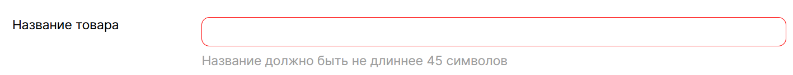
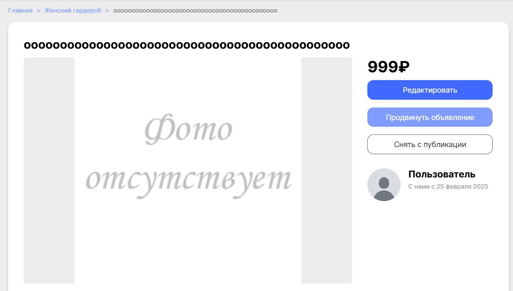
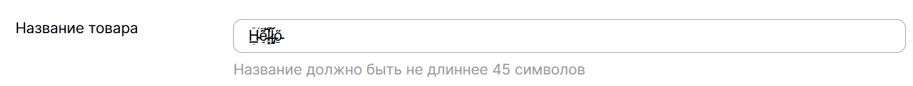
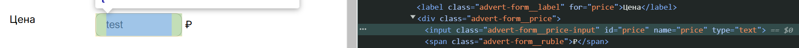
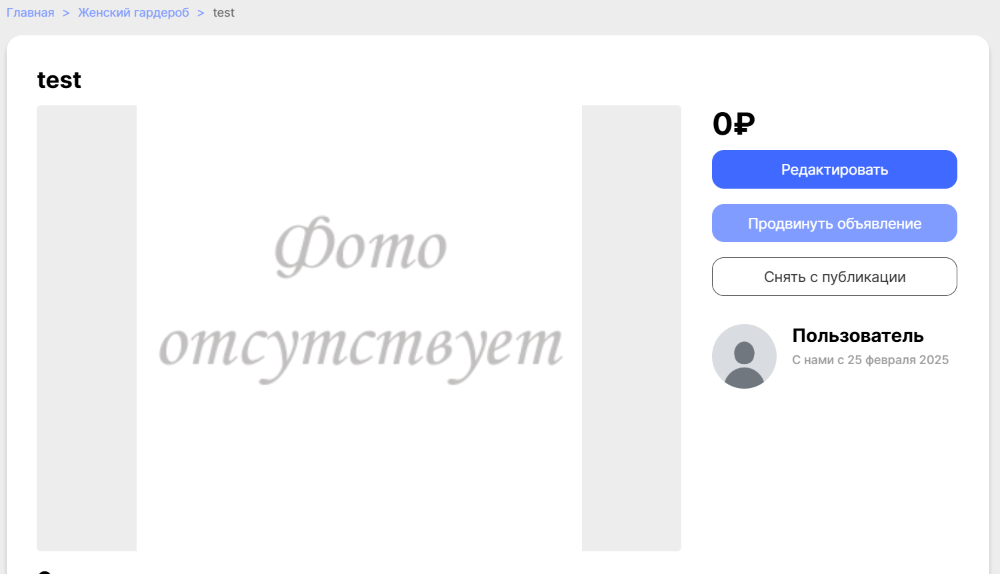

# Тестовый отчет - Команда BogoSort

## 1. Общая информация
**Проект:** Эмпориум  
**Команда:** BogoSort  
**Состав команды:**
- Агеева Ксения 
- Чупраков Сергей 
- Санин Фёдор 
- Куренков Дмитрий

**Ментор:**
- *Пока не известен*

**Дата начала тестирования:**  
**Дата завершения тестирования:**

## 2. Описание тестирования
**Цель тестирования:** Проверка функциональности и нефункциональных характеристик проекта Эмпориум.

**Основные проверяемые характеристики:**
- Функциональность
- Нефункциональные характеристики

> ***Комментарий:***  
> Позитивные и негативные кейсы

## 3. Структура отчета
1. [Функциональное тестирование](#функциональное-тестирование)
2. [Нефункциональное тестирование](#нефункциональное-тестирование)
3. [Баги](#баги)
4. [Выводы](#выводы)

---

## 4. Функциональное тестирование 

### 4.1 Добавление объявления (товара)

#### Создание объявления

##### Положительные сценарии
- [ ] **Успешное добавление товара** 
  - **Ввод:**
    - Категория: _Спорт и отдых_
    - Название товара: _Jogel Мяч баскетбольный JB-100_
    - Цена: _999_
    - Описание: _Топовый мяч, хорошо отскакивает от большинства поверхностей. Хорошо подходит для стритбола и как для начала занятий баскетболом, так и для профессиональной деятельности._
    - Фотография: _Файл изображения см. ниже_
    - Адрес: _Москва, ул. Тверская, 12_  
  - **Действие:** Нажатие на кнопку "Разместить объявление"

    

  - **Ожидание:**
    - Объявление успешно создано и отображается в каталоге.
    - Фотография корректно загружена и отображается в карточке товара.

    
  
    
  
  - **Фактический результат:**
    - [x] Объявление создано, отображается в каталоге.
    - [ ] Изображение не отображается (отсутствует или сломанный значок).

Добавленное изображение:

##### Негативные сценарии

###### Категория

- [ ] **Изменить в html значение value на несуществующее**

###### Название товара
- [x] **Название не заполнено**
    - **Ввод:** Пустое поле
    - **Ожидание:** Подсветить поле ввода: "Название".
    - **Фактический результат:** Выделилось красным поле "Название".  
    
    

- [ ] **Название слишком длинное (> 45 символов)** 
    - **Ввод:** _оооооооооооооооооооооооооооооооооооооооооооооооооо_
    - **Ожидание:** Ошибка "Название не должно превышать 45 символов"
    - **Фактический результат:** Система не обработала ошибку, объявление разместилось.
    
    

- [x] **Название содержит код**
    - **Ввод:** ``
    - **Ожидание:** Создание объявления без выведения на экран фразы "Hello"
    - **Фактический результат:** Создание объявления без выведения на экран фразы "Hello"
- [ ] **Введены битые символы** 
  - **Ввод:** `Hello` обработанное через https://zalgo.org/
  
    
  
  - **Ожидание:** Вывод соответствующего уведомления о невозможности использования подобных символов
  - **Фактический результат:** Объявление удалось создать
  
    

- [ ] **SQL инъекция**
- [ ] **Эмодзи в названии**

###### Цена
- [ ] **Ввод символов после изменения типа (html)** 
  - **Ввод:** `test` // Перед этим изменить type поля на `text`.

  

  - **Ожидание:** Вывод соответствующего уведомления о невозможности использования подобных символов
  - **Фактический результат:** Система пропустила создав объявление с нулевой ценой
  
  

- [ ] **Цена равная 0**
- [ ] **Отрицательная цена**
- [ ] **SQL инъекция после изменения типа (html)**
- [ ] **Битые символы после изменения типа (html)**

###### Описание

###### Фотография

###### Адрес

### 4.2 Корзина
- [ ] Добавление товара в корзину
- [ ] Удаление товара из корзины
- [ ] Корректное отображение итоговой суммы
- [ ] Оформление заказа

---

## 5. Нефункциональное тестирование 

### 5.1 

---

## 6. Баги 

| ID              | Описание бага                                                                 | Шаги для воспроизведения                                                                                                                                                     | Ожидаемый результат          | Фактический результат                     | Приоритет |
|-----------------|-------------------------------------------------------------------------------|------------------------------------------------------------------------------------------------------------------------------------------------------------------------------|------------------------------|-------------------------------------------|-----------|
| [001](#bug-001) | Не отображается изображение после размещение объявления                       | 1. Открыть размещение каталога   2. Заполнить все поля обязательно добавив изображение   3. Нажать на кнопку "Разместить объявление"                                 | Товар добавляется            | Картинка не отображается после добавления | Средний   |
| [002](#bug-002) | Удаётся разместить объявление с названием длиннее чем 45 символов             | 1. Открыть размещение каталога   2. Заполнить все поля, название сделать длинной больше 45 символов   3. Нажать на кнопку "Разместить объявление"                    | Вывод соответствующей ошибки | Объявление разместилось                   | Низкий    |
| [003](#bug-003) | Введены битые символы в названии объявления и они системой никак не запрещены | 1. Открыть размещение каталога   2. Заполнить все поля, название заполнить битыми символами   3. Нажать на кнопку "Разместить объявление"                            | Вывод соответствующей ошибки | Объявление разместилось                   | Низкий    |
| [004](#bug-004) | Введены символы в поле цены (изменение html), а должна вывестись ошибка.      | 1. Открыть размещение каталога   2. Заполнить все поля, цену заполнить символами, перед этим сменив тип поля на `text`   3. Нажать на кнопку "Разместить объявление" | Вывод соответствующей ошибки | Объявление разместилось с ценой равной 0  | Низкий    |

> ***Комментарий:***  
> Шаблон -  
> | 001 | Ошибка при добавлении товара в корзину | 1. Открыть каталог   2. Нажать «Добавить в корзину» | Товар добавляется   | Ошибка 500            | Высокий   |

---

## 7. Выводы 
- Основные функциональности протестированы
- Обнаружены X критические ошибки, которые необходимо исправить
- Дальнейшие рекомендации...

**Дата составления отчета:**
