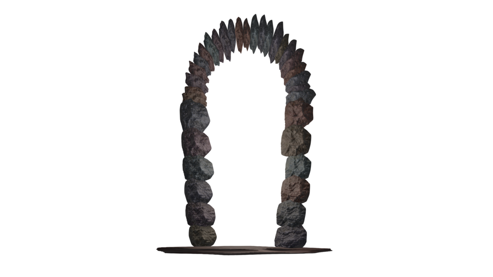

# Тестовый отчет - Команда BogoSort

## 1. Общая информация
**Проект:** Эмпориум  
**Команда:** BogoSort  
**Состав команды:**
- Агеева Ксения 
- Чупраков Сергей 
- Санин Фёдор 
- Куренков Дмитрий

**Ментор:**
- Денис

**Дата начала тестирования:** 25 февраля 2025  
**Дата завершения тестирования:**

## 2. Описание тестирования
**Цель тестирования:** Проверка функциональности и нефункциональных характеристик проекта Эмпориум.

**Основные проверяемые характеристики:**
- Функциональность
- Нефункциональные характеристики

> ***Комментарий:***  
> Позитивные и негативные кейсы

## 3. Структура отчета
1. [Функциональное тестирование](#функциональное-тестирование)
2. [Нефункциональное тестирование](#нефункциональное-тестирование)
3. [Баги](#баги)
4. [Выводы](#выводы)

---

## 4. Функциональное тестирование <a name="функциональное-тестирование"></a>

### 4.1 Добавление объявления (товара)

#### Создание объявления

##### Положительные сценарии
- [ ] **Успешное добавление товара** <a name="bug-4.1-001"></a>
  - **Ввод:**
    - Категория: _Спорт и отдых_
    - Название товара: _Jogel Мяч баскетбольный JB-100_
    - Цена: _999_
    - Описание: 
```md
Топовый мяч, хорошо отскакивает от большинства поверхностей. Хорошо подходит для стритбола и как для начала занятий баскетболом, так и для профессиональной деятельности.
```

    - Фотография: _Файл изображения см. ниже_
    - Адрес: _Москва, ул. Тверская, 12_  
  - **Действие:** Нажатие на кнопку "Разместить объявление"

    

  - **Ожидание:**
    - Объявление успешно создано и отображается в каталоге.
    - Фотография корректно загружена и отображается в карточке товара.

    
  
    
  
  - **Фактический результат:**
    - [x] Объявление создано, отображается в каталоге.
    - [ ] Изображение не отображается (отсутствует или сломанный значок).

Добавленное изображение:


##### Негативные сценарии

###### Категория

- [ ] **Изменить в html значение value на несуществующее**  <a name="bug-4.1-006"></a>
  - **Ввод:** Категория `Женский гардероб` // Перед этим поменять значение value с `d4d10f10-4f9a-4bd5-ab1e-d2fc3ed35748` на `d4d10f10-4f9a-4bd5-ab1e-d2fc3ed35700`.
  
  

  - **Ожидание:** Не пропустит, вернет ошибку
  - **Фактический результат:** Не пропустило, вернуло ошибку, но с бекенда.

  

  

###### Название товара
- [x] **Название не заполнено**
    - **Ввод:** Пустое поле
    - **Ожидание:** Подсветить поле ввода: "Название".
    - **Фактический результат:** Выделилось красным поле "Название".

    

- [ ] **Название слишком длинное (> 45 символов)** <a name="bug-4.1-002"></a>
    - **Ввод:**
```md
оооооооооооооооооооооооооооооооооооооооооооооооооо
```

    - **Ожидание:** Ошибка "Название не должно превышать 45 символов"
    - **Фактический результат:** Система не обработала ошибку, объявление разместилось.
    
    

- [ ] **Название содержит код** <a name="bug-4.1-005"></a>
    - **Ввод:**
```js
<script>alert("Hello")</script>
```
    - **Ожидание:** Создание объявления без выведения на экран фразы "Hello"
    - **Фактический результат:** Создание объявления без выведения на экран фразы "Hello", но с пустым названием
- [ ] **Введены битые символы** <a name="bug-4.1-003"></a>
  - **Ввод:** `Hello` // обработанное через https://zalgo.org/
  
    
  
  - **Ожидание:** Вывод соответствующего уведомления о невозможности использования подобных символов
  - **Фактический результат:** Объявление удалось создать
  
    

- [x] **Эмодзи в названии**
  - **Ввод:** `🙂`
  - **Ожидание:** Создание объявления с таким названием.
  - **Фактический результат:** Создание объявления с таким названием.
  
  

###### Цена
- [ ] **Ввод символов после изменения типа (html)** <a name="bug-4.1-004"></a>
  - **Ввод:** `test` // Перед этим изменить type поля на `text`.

  

  - **Ожидание:** Вывод соответствующего уведомления о невозможности использования подобных символов
  - **Фактический результат:** Система пропустила создав объявление с нулевой ценой
  
  

- [x] **Цена равная 0**
  - **Ввод:** `0`
  - **Ожидание:** Вывод соответствующего уведомления о невозможности цены 0
  - **Фактический результат:** Система пропустила создав объявление с нулевой ценой
  
  

- [x] **Отрицательная цена**
  - **Ввод:** `-2`
  
  

  - **Ожидание:** Выделилось красным поле "Цена".
  - **Фактический результат:** Выделилось красным поле "Цена".
  
  

- [x] **Битые цифры (html)**
  - **Ввод:** `1` // обработать через https://zalgo.org/ и перед этим изменить type поля на `text`.
  
  

  - **Ожидание:** Выделилось красным поле "Цена".
  - **Фактический результат:** Выделилось красным поле "Цена".

  

- [x] **Дробные числа**
  - **Ввод:** `0.55555`
  - **Ожидание:** Вывод соответствующего уведомления о невозможности дробной цены
  - **Фактический результат:** Вывод соответствующего уведомления о невозможности дробной цены
  
  

- [x] **Дробные числа (html)**
  - **Ввод:** `0.55555` // Перед этим изменить type поля на `text`.

  

  - **Ожидание:** Вывод соответствующего уведомления о невозможности дробной цены
  - **Фактический результат:** Выделилось красным поле "Цена".

  

- [x] **Пустое поле**
  - **Ввод:** Пустое поле
  - **Ожидание:** Вывод соответствующего уведомления о невозможности пустой цены
  - **Фактический результат:** Выделилось красным поле "Цена".

  

###### Описание

- [] **Пустое поле**
  - **Ввод:** Пустое поле
  
  

  - **Ожидание:** Вывод соответствующего уведомления о невозможности отсутствия описания
  - **Фактический результат:** Выделилось красным поле "Описание".

  

- [x] **Длинное описание (html)**
  - **Ввод:** 
```md
ssssssssssssssssssssssssssssssssssssssssssssssssssssssssssssssssssssssssssssssssssssssssssssssssssssssssssssssssssssssssssssssssssssssssssssssssssssssssssssssssssssssssssssssssssssssssssssssssssssssssssssssssssssssssssssssssssssssssssssssssssssssssssssssssssssssssssssssssssssssssssssssssssssssssssssssssssssssssssssssssssssssssssssssssssssssssssssssssssssssssssssssssssssssssssssssssssssssssssssssssssssssssssssssssssssssssssssssssssssssssssssssssssssssssssssssssssssssssssssssssssssssssssssssssssssssssssssssssssssssssssssssssssssssssssssssssssssssssssssssssssssssssssssssssssssssssssssssssssssssssssssssssssssssssssssssssssssssssssssssssssssssssssssssssssssssssssssssssssssssssssssssssssssssssssssssssssssssssssssssssssssssssssssssssssssssssssssssssssssssssssssssssssssssssssssssssssssssssssssssssssssssssssssssssssssssssssssssssssssssssssssssssssssssssssssssssssssssssssssssssssssssssssssssssssssssssssssssssssssssssssssssssssssssssssssssssssssssssssssssssssssssssssssssssssssssssssssssssssssssssssssssssssssssssssssssssssssssssssssssssssssssssssssssssssssssssssssssssssssssssssssssssssssssssssssssssssssssssssssssssssssssssssssssssssssssssssssssssssssssssssssssssssssssssssssssssssssssssssssssssssssssssssssssssssssssssssssssssssssssssssssssssssssssssssssssssssssssssssssssssssssssssssssssssssssssssssssssssssssssssssssssssssssssssssssssssssssssssssssssssssssssssssssssssssssssssssssssssssssssssssssssssssssssssssssssssssssssssssssssssssssssssssssssssssssssssssssssssssssssssssssssssssssssssssssssssssssssssssssssssssssssssssssssssssssssssssssssssssssssssssssssssssssssssssssssssssssssssssssssssssssssssssssssssssssssssssssssssssssssssssssssssssssssssssssssssssssssssssssssssssssssssssssssssssssssssssssssssssssssssssssssssssssssssssssssssssssssssssssssssssssssssssssssssssssssssssssssssssssssssssssssssssssssssssssssssssssssssssssssssssssssssssssssssssssssssssssssssssssssssssssssssssssssssssssssssssssssssssssssssssssssssssssssssssssssssssssssssssssssssssssssssssssssssssssssssssssssssssssssssssssssssssssssssssssssssssssssssssssssssssssssssssssssssssssssssssssssssssssssssssssssssssssssssssssssssssssssssssssssssssssssssssssssssssssssssssssssssssssssssssssssssssssssssssssssssssssssssssssssssssssssssssssssssssssssssssssssssssssssssssssssssssssssssssssssssssssssssssssssssssssssssssssssssssssssssssssssssssssssssssssssssssssssssssssssssssssssssssssssssssssssssssssssssssssssssssssssssssssssssssssssssssssssssssssssssssssssssssssssssssssssssssssssssssssssssssssssssssssssssssssssssssssssssssssssssssssssssssssssssssssssssssssssssssssssssssssssssssssssssssssssssssssssssssssssssssssssssssssssssssssssssssssssssssssssssssssssssssssssssssssssssssssssssssssssssssssssssssssssssssssssssssssssssssssssssssssssssssssssssssssssssssssssssssssssssssssssssssssssssssssssssssssssssssssssssssssssssssssssssssssssssssssssssssssssssssssssssssssssssssssssssssssssssssssssssssssssssssssssssssssssssssssssssssssssssssssssssssssssssssssssssssssssssssssssssssssssssssssssssssssssssssssssssssssssssssssssssssssssssssssssssssssssssssssssssssssssssssssssssssssssssssssssssssssssssssssssssssssssssssssssssssssssssssssssssssssssssssssssssssssssssssssssssssssssssssssssssssssssssssssssssssssssssssssssssssssssssssssssssssssssssssssssssssssssssssssssssssssssssssssssssssssssssssssssssssssssssssssssssssssssssssssssssssssssssssssssssssssssssssssssssssssssssssssssssssssssssssssssssssssssssssssssssssssssssssssssssssssssssssssssssssssssssssssssssssssssssssssssssssssssssssssssssssssssssssssssssssssssssssssssssssssssssssssssssssssssssssssssssssssssssssssssssssssssssssssssssssssssssssssssssssssssssssssssssssssssssssssssssssssssssssssssssssssssssssssssssssssssssssssssssssssssssssssssssssssssssssssssssssssssssssssssssssssssssssssssssssssssssssssssssssssssssssssssssssssssssssssssssssssssssssssssssssssssssssssssssssssssssssssssssssssssssssssssssssssssssssssssssssssssssssssssssssssssssssssssssssssssssssssssssssssssssssssssssssssssssssssssssssssssssssssssssssssssssssssssssssssssssssssssssssssssssssssssssssssssssssssssssssssssssssssssssssssssssssssssssssssssssssssssssssssssssssssssssssssssssssssssssssssssssssssssssssssssssssssssssssssssssssssssssssssssssssssssssssssssssssssssssssssssssssssssssssssssssssssssssssssssssssssssssssssssssssssssssssssssssssssssssssssssssssssssssssssssssssssssssssssssssssssssssssssssssssssssssssssssssssssssssssssssssssssssssssssssssssssssssssssssssssssssssssssssssssssssssssssssssssssssssssssssssssssssssssssssssssssssssssssssssssssssssssssssssssssssssssssssssssssssssssssssssssssssssssssssssssssssssssssssssssssssssssssssssssssssssssssssssssssssssssssssssssssssssssssssssssssssssssssssssssssssssssssssssssssssssssssssssssssssssssssssssssssssssssssssssssssssssssssssssssssssssssssssssssssssssssssssssssssssssssssssssssssssssssssssssssssssssssssssssssssssssssssssssssssssssssssssssssssssssssssssssssssssssssssssssssssssssssssssssssssssssssssssssssssssssssssssssssssssssssssssssssssssssssssssssssssssssssssssssssssssssssssssssssssssssssssssssssssssssssssssssssssssssssssssssssssssssssssssssssssssssssssssssssssssssssssssssssssssssssssssssssssssssssssssssssssssssssssssssssssssssssssssssssssssssssssssssssssssssssssssssssssssssssssssssssssssssssssssssssssssssssssssssssssssssssssssssssssssssssssssssssssssssssssssssssssssssssssssssssssssssssssssssssssssssssssssssssssssssssssssssssssssssssssssssssssssssssssssssssssssssssssssssssssssssssssssssssssssssssssssssssssssssssssssssssssssssssssssssssssssssssssssssssssssssssssssssssssssssssssssssssssssssssssssssssssssssssssssssssssssssssssssssssssssssssssssssssssssssssssssssssssssssssssssssssssssssssssssssssssssssssssssssssssssssssssssssssssssssssssssssssssssssssssssssssssssssssssssssssssssssssssssssssssssssssssssssssssssssssssssssssssssssssssssssssssssssssssssssssssssssssssssssssssssssssssssssssssssssssssssssssssssssssssssssssssssssssssssssssssssssssssssssssssssssssssssssssssssssssssssssssssssssssssssssssssssssssssssssssssssssssssssssssssssssssssssssssssssssssssssssssssssssssssssssssssssssssssssssssssssssssssssssssssssssssssssssssssssss
```

  /img.png)

  - **Ожидание:** Вывод соответствующего уведомления о невозможности отсутствия описания
  - **Фактический результат:** Выделилось красным поле "Описание".

  /img_1.png)

- [ ] **Описание содержит код** <a name="bug-4.1-007"></a>
  - **Ввод:**
```js
<script>alert("Hello")</script>
```
    - **Ожидание:** Создание объявления без выведения на экран фразы "Hello"
    - **Фактический результат:** Создание объявления без выведения на экран фразы "Hello", но с пустым описанием

- [ ] **Введены битые символы** <a name="bug-4.1-008"></a>
  - **Ввод:** `Hello` // обработанное через https://zalgo.org/

    

  - **Ожидание:** Вывод соответствующего уведомления о невозможности использования подобных символов
  - **Фактический результат:** Объявление удалось создать

    

- [ ] **Введены сильно битые символы** <a name="bug-4.1-009"></a>
  - **Ввод:** `Hello` // обработанное через https://zalgo.org/

    

  - **Ожидание:** Вывод соответствующего уведомления о невозможности использования подобных символов
  - **Фактический результат:** Несколько ошибок с бекенда, ошибка открытия объявления, хотя на фронте отрабатывает как для созданного

    

    

###### Фотография

- [ ] **Попытка добавить png** <a name="bug-4.1-010"></a>
  - **Ввод:** png и zip (адрес - `img/4.1/Создание объявления/Негативные сценарии/Фотография/png-zip/test.zip`)

    

  - **Ожидание:** Вывод соответствующего уведомления о невозможности использования подобного типа
  - **Фактический результат:** Объявление удалось создать

###### Адрес

### 4.2 Корзина
- [ ] Добавление товара в корзину
- [ ] Удаление товара из корзины
- [ ] Корректное отображение итоговой суммы
- [ ] Оформление заказа

---

## 5. Нефункциональное тестирование <a name="нефункциональное-тестирование"></a>

### 5.1 

---

## 6. Баги <a name="баги"></a>

| ID                      | Описание бага                                                                                                                                                                  | Шаги для воспроизведения                                                                                                                                                     | Ожидаемый результат                   | Фактический результат                      | Приоритет                          |
|-------------------------|--------------------------------------------------------------------------------------------------------------------------------------------------------------------------------|------------------------------------------------------------------------------------------------------------------------------------------------------------------------------|---------------------------------------|--------------------------------------------|------------------------------------|
| [4.1-001](#bug-4.1-001) | Не отображается изображение после размещение объявления                                                                                                                        | 1. Открыть размещение каталога  <br/>2. Заполнить все поля обязательно добавив изображение  <br/>3. Нажать на кнопку "Разместить объявление"                                 | Товар добавляется                     | Картинка не отображается после добавления  | 🟠 $${\color{darkorange}Средний}$$ |
| [4.1-002](#bug-4.1-002) | Удаётся разместить объявление с названием длиннее чем 45 символов                                                                                                              | 1. Открыть размещение каталога  <br/>2. Заполнить все поля, название сделать длинной больше 45 символов  <br/>3. Нажать на кнопку "Разместить объявление"                    | Вывод соответствующей ошибки          | Объявление разместилось                    | 🟡 $${\color{gold}Низкий}$$        |
| [4.1-003](#bug-4.1-003) | Введены битые символы в названии объявления и они системой никак не запрещены                                                                                                  | 1. Открыть размещение каталога  <br/>2. Заполнить все поля, название заполнить битыми символами  <br/>3. Нажать на кнопку "Разместить объявление"                            | Вывод соответствующей ошибки          | Объявление разместилось                    | 🟡 $${\color{gold}Низкий}$$        |
| [4.1-004](#bug-4.1-004) | Введены символы в поле цены (изменение html), а должна вывестись ошибка                                                                                                        | 1. Открыть размещение каталога  <br/>2. Заполнить все поля, цену заполнить символами, перед этим сменив тип поля на `text`  <br/>3. Нажать на кнопку "Разместить объявление" | Вывод соответствующей ошибки          | Объявление разместилось с ценой равной 0   | 🟡 $${\color{gold}Низкий}$$        |
| [4.1-005](#bug-4.1-005) | Удалось создать товар с пустым названием                                                                                                                                       | 1. Открыть размещение каталога  <br/>2. Заполнить все поля, название заполнить скриптом `<script>alert("Hello")</script>`  <br/>3. Нажать на кнопку "Разместить объявление"  | Создание объявления с таким названием | Объявление разместилось с пустым названием | 🟡 $${\color{gold}Низкий}$$        |
| [4.1-006](#bug-4.1-006) | Изменено значение value у категории                                                                                                                                            | 1. Открыть размещение каталога  <br/>2. Через код страницы поменять значение value и выбрать измененное значение  <br/>3. Нажать на кнопку "Разместить объявление"           | Вывод соответствующей ошибки          | Ошибка пришла с бекенда                    | 🟡 $${\color{gold}Низкий}$$        |
| [4.1-007](#bug-4.1-007) | Удалось создать товар с пустым описанием                                                                                                                                       | 1. Открыть размещение каталога  <br/>2. Заполнить все поля, описание заполнить скриптом `<script>alert("Hello")</script>`  <br/>3. Нажать на кнопку "Разместить объявление"  | Создание объявления с таким названием | Объявление разместилось с пустым названием | 🟡 $${\color{gold}Низкий}$$        |
| [4.1-008](#bug-4.1-008) | Введены битые символы в описании объявления и они системой никак не запрещены                                                                                                  | 1. Открыть размещение каталога  <br/>2. Заполнить все поля, описание заполнить битыми символами  <br/>3. Нажать на кнопку "Разместить объявление"                            | Вывод соответствующей ошибки          | Объявление разместилось                    | 🟡 $${\color{gold}Низкий}$$        |
| [4.1-009](#bug-4.1-009) | Введены сильно битые символы в описании объявления и они системой никак не запрещены, ошибки со стороны бекенда, возможная высокая уязвимость, проходит далеко                 | 1. Открыть размещение каталога  <br/>2. Заполнить все поля, описание заполнить сильно битыми символами  <br/>3. Нажать на кнопку "Разместить объявление"                     | Вывод соответствующей ошибки          | Несколько ошибок со стороны бекенда        | 🔴 $${\color{red}Высокий}$$        |
| [4.1-010](#bug-4.1-010) | Прокидываются картинки других типов, возможная уязвимость (zip-бомба, Path Traversal (архив с путями вне разрешенной директории), прокидывание скриптов (майнер, червь...) ... | 1. Открыть размещение каталога  <br/>2. Заполнить все поля, добавить png картинку  <br/>3. Нажать на кнопку "Разместить объявление"                                          | Вывод соответствующей ошибки          | Объявление разместилось                    | 🔴 $${\color{red}Высокий}$$        |

> ***Комментарий:***  
> Шаблон -  
> | 001 | Ошибка при добавлении товара в корзину | 1. Открыть каталог  <br/>2. Нажать «Добавить в корзину» | Товар добавляется   | Ошибка 500            | Высокий   |

---

## 7. Выводы <a name="выводы"></a>
- Основные функциональности протестированы
- Обнаружены X критические ошибки, которые необходимо исправить
- Дальнейшие рекомендации...

**Дата составления отчета:**
